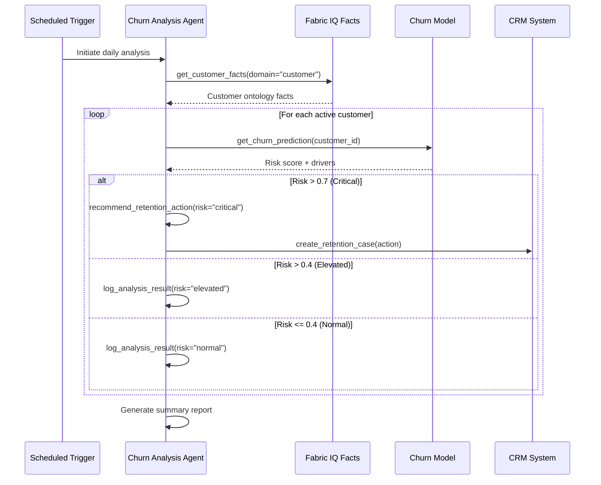

# Customer Churn Analysis Agent Specification

## Overview

| Property | Value |
|----------|-------|
| **Spec ID** | `CCA-001` |
| **Version** | `1.0.0` |
| **Status** | `Active` |
| **Domain** | Customer Analytics |
| **Agent Type** | Single Agent with Tools |
| **Governance Model** | Autonomous |

## Business Framing

Customer churn analysis is critical for subscription-based businesses to identify at-risk customers before they leave. This agent leverages predictive modeling and real-time signals to proactively identify churn risk and recommend retention actions.

### Value Proposition
The Customer Churn Analysis Agent shifts retention operations from reactive (responding to cancellation requests) to proactive (intervening before customers decide to leave). It integrates with Fabric IQ for ontology-grounded customer facts and provides actionable recommendations to retention teams.

## Target Problems Addressed

| Problem | Impact | Agent Solution |
|---------|--------|----------------|
| Late churn detection | Lost revenue | Predictive risk scoring |
| Manual analysis | Slow response | Automated daily runs |
| Fragmented data | Incomplete picture | Unified facts memory |
| Generic interventions | Low effectiveness | Personalized recommendations |

## Agent Architecture

### Single Agent with Tool Orchestration

```
┌─────────────────────────────────────────────────────────────────────┐
│                    Churn Analysis Agent                             │
│         Orchestrates tools for analysis and recommendations         │
└────────────────────┬────────────────────────────────────────────────┘
                     │
    ┌────────────────┼────────────────┬────────────────┐
    ▼                ▼                ▼                ▼
┌─────────┐   ┌───────────┐   ┌───────────┐   ┌───────────┐
│ Facts   │   │  Scoring  │   │  Recommend│   │  CRM      │
│ Memory  │   │   Model   │   │   Engine  │   │  Actions  │
└─────────┘   └───────────┘   └───────────┘   └───────────┘
```

### Control Plane Integration

| Component | Azure Service | Integration Pattern |
|-----------|---------------|---------------------|
| API Gateway | Azure API Management | MCP façade |
| Agent Runtime | Azure Kubernetes Service | Workload identity |
| Facts Memory | Fabric IQ | Ontology-grounded customer facts |
| ML Scoring | Azure AI Foundry | Churn prediction model |
| Identity | Microsoft Entra ID | Agent Identity |
| Observability | Azure Monitor + App Insights | OpenTelemetry |

## MCP Tool Catalog

| Tool Name | Description | Input Schema |
|-----------|-------------|--------------|
| `get_customer_facts` | Retrieve customer facts from Fabric IQ | `{ customer_id: string, domain: "customer" }` |
| `get_churn_prediction` | Get churn risk score and drivers | `{ customer_id: string }` |
| `get_customer_segment` | Retrieve customer segmentation | `{ customer_id: string }` |
| `search_similar_churned` | Find similar customers who churned | `{ customer_profile: object, limit: int }` |
| `recommend_retention_action` | Generate personalized retention recommendation | `{ customer_id: string, risk_level: string }` |
| `create_retention_case` | Create case in CRM for outreach | `{ customer_id: string, action: object }` |
| `log_analysis_result` | Log analysis result for tracking | `{ customer_id: string, result: object }` |

## Workflow Specification

### Primary Flow: Daily Churn Risk Assessment



### Secondary Flow: On-Demand Analysis

1. CSR requests analysis for specific customer
2. Agent retrieves customer facts from Fabric IQ
3. Agent runs churn prediction model
4. Agent searches for similar churned customers
5. Agent generates personalized recommendation
6. Response delivered to CSR in real-time

## Fabric IQ Facts Memory Integration

### Customer Domain Ontology

| Entity Type | Attributes | Relationships |
|-------------|------------|---------------|
| Customer | id, name, segment, tenure, status | has_transactions, has_engagement |
| Transaction | id, amount, date, type | belongs_to_customer |
| Engagement | id, event_type, date, channel | belongs_to_customer |
| ChurnPrediction | id, score, drivers, date | predicts_for_customer |

### Fact Types

| Fact Type | Example | Usage |
|-----------|---------|-------|
| `observation` | "Customer tenure is 8 months" | Current state |
| `prediction` | "Customer has 82% churn risk" | ML-derived |
| `derived` | "Transaction frequency dropped 40%" | Calculated |
| `rule` | "Critical risk requires immediate outreach" | Business logic |

### Sample Facts Query

```json
{
  "query": "high churn risk customers in business segment",
  "domain": "customer",
  "filters": {
    "fact_type": "prediction",
    "confidence_threshold": 0.7
  },
  "limit": 100
}
```

## Success Metrics (KPIs)

### Business Metrics

| Metric | Target | Measurement |
|--------|--------|-------------|
| Churn Rate Reduction | -15% | Monthly cohort |
| Early Detection Rate | > 80% | Prediction vs actual |
| Retention Intervention ROI | > 3x | Revenue saved / cost |
| Customer Lifetime Value | +10% | CLV improvement |

### Technical Metrics

| Metric | Target | Measurement |
|--------|--------|-------------|
| Prediction Accuracy (AUC) | > 0.85 | Model evaluation |
| API Latency P95 | < 500ms | App Insights |
| Facts Query Latency | < 200ms | Fabric IQ metrics |
| Daily Run Completion | 100% | Job monitoring |

## Testing Requirements

### Unit Tests

| Test Category | Coverage Target | Description |
|---------------|-----------------|-------------|
| Facts Retrieval | 90% | Ontology query logic |
| Score Interpretation | 85% | Risk level mapping |
| Recommendation Logic | 95% | Action selection |
| MCP Protocol | 100% | Tool schema compliance |

### Integration Tests

| Test Scenario | Validation |
|---------------|------------|
| End-to-end analysis | Customer flagged correctly |
| CRM case creation | Case created with correct data |
| Facts memory search | Semantic search returns relevant results |
| Cross-domain analysis | Correlation with DevOps facts |

### Evaluation Tests

| Evaluation | Framework | Threshold |
|------------|-----------|-----------|
| Prediction Accuracy | Confusion matrix | > 0.85 precision |
| Recommendation Relevance | GPT-4 judge | > 0.80 |
| Groundedness | Fact verification | > 0.90 |

## Fine-Tuning Specification

### Episode Capture

| Field | Description |
|-------|-------------|
| `episode_id` | Unique identifier |
| `agent_id` | churn-analysis-agent |
| `customer_id` | Analyzed customer |
| `input_facts` | Facts provided to agent |
| `prediction` | Churn score and drivers |
| `recommendation` | Action recommended |
| `outcome` | Actual churn status (30/60/90 days) |

### Reward Signals

| Signal | Source | Weight |
|--------|--------|--------|
| Correct prediction (TP/TN) | Outcome tracking | 1.0 |
| Customer retained | CRM outcome | 0.8 |
| Recommendation accepted | CSR feedback | 0.3 |
| False positive | Outcome tracking | -0.3 |
| False negative (missed churn) | Outcome tracking | -1.0 |

## Governance & Compliance

### Data Privacy

| Requirement | Implementation |
|-------------|----------------|
| PII Handling | Tokenized customer IDs |
| Data Retention | 90-day analysis logs |
| Access Control | Role-based access to predictions |
| Audit Trail | All queries logged |

### Human Oversight

| Scenario | Escalation Path |
|----------|-----------------|
| Critical risk customer | Immediate manager notification |
| Bulk action (>100 customers) | Requires approval |
| New segment (no training data) | Manual review required |

## Version History

| Version | Date | Author | Changes |
|---------|------|--------|---------|
| 1.0.0 | 2026-02-01 | Azure Agents Team | Initial specification |
