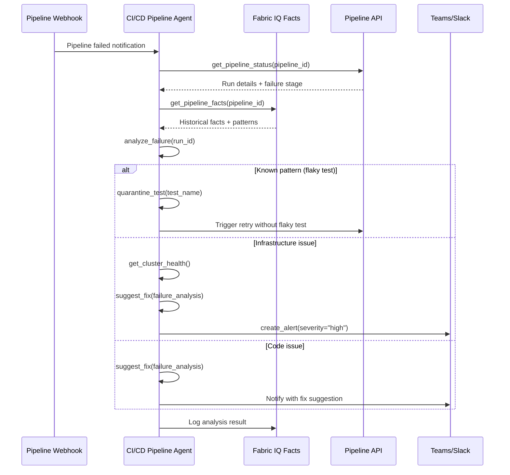
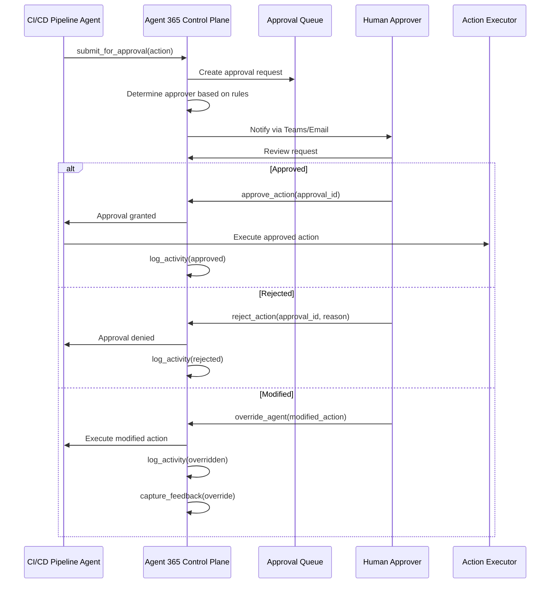

# CI/CD Pipeline Agent Specification with Agent 365 Human-in-the-Loop Integration

## Overview

| Property | Value |
|----------|-------|
| **Spec ID** | `CICD-001` |
| **Version** | `2.0.0` |
| **Status** | `Active` |
| **Domain** | DevOps Automation + Enterprise Productivity |
| **Agent Type** | Multi-Agent with Human Oversight |
| **Governance Model** | Autonomous with HITL for production via Agent 365 |

## Business Framing

DevOps teams manage complex CI/CD pipelines across multiple repositories, environments, and Kubernetes clusters. Pipeline failures, deployment issues, and configuration drift require rapid diagnosis and resolution. The CI/CD Pipeline Agent provides intelligent automation for pipeline health monitoring, failure analysis, and deployment optimization.

Enterprise AI agents often require human oversight for critical decisions, compliance verification, and approval workflows. Agent 365 provides a unified control plane for human-in-the-loop interactions, enabling administrators and business users to review, approve, or override agent recommendations before execution.

### Value Proposition
The CI/CD Pipeline Agent shifts DevOps operations from reactive troubleshooting to proactive pipeline management. It integrates with Fabric IQ for ontology-grounded DevOps facts and provides actionable insights for pipeline optimization.

Agent 365 bridges the gap between autonomous AI capabilities and enterprise governance requirements. It ensures that AI agents operate within approved boundaries while enabling human experts to guide and correct agent behavior in real-time.

## Target Problems Addressed

| Problem | Impact | Agent Solution |
|---------|--------|----------------|
| Pipeline failures | Delayed releases | Automated root cause analysis |
| Flaky tests | False positives | Pattern detection and quarantine |
| Deployment drift | Environment inconsistency | Configuration validation |
| Manual investigation | Engineer time waste | AI-powered diagnostics |
| Uncontrolled AI actions | Compliance risk | Agent 365 approval workflows |
| Lack of visibility | Trust deficit | Action transparency via Agent 365 |
| No override capability | Operational rigidity | Human intervention via Agent 365 |
| Fragmented oversight | Governance gaps | Unified control plane |

## Agent Architecture

### Multi-Agent with Tool Orchestration and Human Oversight Layer

```
┌─────────────────────────────────────────────────────────────────────┐
│                    CI/CD Pipeline Agent                             │
│         Orchestrates tools for pipeline management                  │
└────────────────────┬────────────────────────────────────────────────┘
                     │
    ┌────────────────┼────────────────┬────────────────┐
    ▼                ▼                ▼                ▼
┌─────────┐   ┌───────────┐   ┌───────────┐   ┌───────────┐
│ DevOps  │   │  Pipeline │   │  Cluster  │   │  Alert    │
│  Facts  │   │   API     │   │   Health  │   │   Mgmt    │
└─────────┘   └───────────┘   └───────────┘   └───────────┘
                     │
                     ▼
┌─────────────────────────────────────────────────────────────────────┐
│                    Agent 365 Control Plane                          │
│         Unified human oversight for enterprise agents               │
└────────────────────┬────────────────────────────────────────────────┘
                     │
    ┌────────────────┼────────────────┬────────────────┐
    ▼                ▼                ▼                ▼
┌─────────┐   ┌───────────┐   ┌───────────┐   ┌───────────┐
│ Approval│   │  Activity │   │  Escalation│   │  Feedback │
│  Queue  │   │   Log     │   │   Router   │   │  Capture  │
└─────────┘   └───────────┘   └───────────┘   └───────────┘
```

### Control Plane Integration

| Component | Azure Service | Integration Pattern |
|-----------|---------------|---------------------|
| API Gateway | Azure API Management | MCP façade |
| Agent Runtime | Azure Kubernetes Service | Workload identity |
| Facts Memory | Fabric IQ | DevOps domain ontology |
| Pipeline API | Azure DevOps / GitHub Actions | REST API |
| Cluster Health | AKS Management API | Kubernetes API |
| Identity | Microsoft Entra ID | Agent Identity |
| Observability | Azure Monitor + App Insights | OpenTelemetry |
| Approval Queue | Cosmos DB + Power Automate | Event-driven workflow |
| Activity Log | Azure Monitor + Cosmos DB | Comprehensive audit |
| Escalation Router | Event Grid + Logic Apps | Rule-based routing |
| Feedback Capture | Cosmos DB | Fine-tuning signals |
| Notifications | Teams + Email | Multi-channel |

## MCP Tool Catalog

### CI/CD Pipeline Tools

| Tool Name | Description | Input Schema |
|-----------|-------------|--------------|
| `get_pipeline_facts` | Retrieve pipeline facts from Fabric IQ | `{ pipeline_id: string, domain: "devops" }` |
| `get_pipeline_status` | Get current pipeline run status | `{ pipeline_id: string }` |
| `get_pipeline_history` | Get historical pipeline runs | `{ pipeline_id: string, limit: int }` |
| `analyze_failure` | Analyze pipeline failure root cause | `{ run_id: string }` |
| `get_cluster_health` | Get AKS cluster health status | `{ cluster_name: string }` |
| `get_deployment_status` | Get Kubernetes deployment status | `{ namespace: string, deployment: string }` |
| `suggest_fix` | Generate fix suggestion for failure | `{ failure_analysis: object }` |
| `create_alert` | Create alert for pipeline issue | `{ severity: string, message: string }` |
| `quarantine_test` | Mark flaky test for quarantine review | `{ test_name: string, failure_pattern: string }` |

### Agent 365 Human-in-the-Loop Tools

| Tool Name | Description | Input Schema |
|-----------|-------------|--------------|
| `submit_for_approval` | Submit agent action for human approval | `{ action: object, approver_role: string, urgency: string }` |
| `get_approval_status` | Check status of pending approval | `{ approval_id: string }` |
| `log_activity` | Log agent activity for audit | `{ agent_id: string, action: object, outcome: string }` |
| `escalate_to_human` | Escalate decision to human expert | `{ context: object, reason: string, suggested_action: object }` |
| `capture_feedback` | Capture human feedback on agent output | `{ episode_id: string, rating: float, comments: string }` |
| `get_approval_queue` | Get pending approvals for user | `{ approver_id: string }` |
| `approve_action` | Approve pending agent action | `{ approval_id: string, notes: string }` |
| `reject_action` | Reject pending agent action | `{ approval_id: string, reason: string, alternative: string }` |
| `override_agent` | Override agent recommendation | `{ episode_id: string, override_action: object, justification: string }` |

## Workflow Specification

### Primary Flow: Pipeline Failure Analysis



### Secondary Flow: Proactive Health Check

1. Scheduled trigger initiates health check
2. Agent retrieves all active pipelines
3. Agent checks each pipeline's success rate trend
4. Agent identifies degrading pipelines
5. Agent generates optimization recommendations
6. Report delivered to DevOps team

### Tertiary Flow: Deployment Validation

1. Deployment webhook triggers agent
2. Agent validates deployment configuration
3. Agent checks for drift from baseline
4. Agent monitors rollout health
5. Agent alerts on issues or confirms success

### Agent 365 Approval Workflow



### Escalation Workflow

1. Agent encounters uncertainty or edge case
2. Agent calls `escalate_to_human()` with context
3. Escalation router determines appropriate expert
4. Expert receives context and suggested action
5. Expert provides guidance or takes over
6. Feedback captured for agent learning

### Activity Monitoring

1. All connected agents log activities
2. Activity dashboard provides real-time visibility
3. Anomaly detection flags unusual patterns
4. Administrators can intervene if needed
5. Comprehensive audit trail maintained

## Approval Rules Configuration

### Rule Schema

```json
{
  "rule_id": "string",
  "rule_name": "string",
  "agent_id": "string|*",
  "action_type": "string|*",
  "conditions": [
    {
      "field": "string",
      "operator": "eq|gt|lt|contains",
      "value": "any"
    }
  ],
  "approver_role": "string",
  "sla_hours": "number",
  "auto_approve_after_sla": "boolean",
  "escalation_path": ["string"]
}
```

### Example Approval Rules

| Rule | Trigger | Approver | SLA |
|------|---------|----------|-----|
| Production deployment | env = "production" | DevOps Lead | 2 hours |
| Cluster-wide change | scope = "cluster" | Platform Engineer | 1 hour |
| Secret rotation | action = "rotate_secret" | Security Lead | 30 min |
| Rollback action | action = "rollback" | Release Manager | 15 min |

## Fabric IQ Facts Memory Integration

### DevOps Domain Ontology

| Entity Type | Attributes | Relationships |
|-------------|------------|---------------|
| Pipeline | id, name, repo, success_rate, avg_duration | has_runs, targets_cluster |
| PipelineRun | id, status, duration, triggered_by, branch | belongs_to_pipeline |
| Deployment | id, version, timestamp, environment, status | deployed_by_run, targets_cluster |
| Cluster | id, name, region, status, node_count | hosts_deployments |
| Test | id, name, success_rate, is_flaky | belongs_to_pipeline |

### Fact Types

| Fact Type | Example | Usage |
|-----------|---------|-------|
| `observation` | "Pipeline 'api-gateway' has 93% success rate" | Current state |
| `prediction` | "Pipeline likely to fail due to resource constraints" | ML-derived |
| `derived` | "Test 'auth-integration' is flaky (60% pass rate)" | Calculated |
| `rule` | "Production deployments require approval" | Business logic |

### Sample Facts Query

```json
{
  "query": "failed pipelines in last 24 hours",
  "domain": "devops",
  "filters": {
    "entity_type": "PipelineRun",
    "status": "failed",
    "time_range": "24h"
  },
  "limit": 50
}
```

## Success Metrics (KPIs)

### Business Metrics

| Metric | Target | Measurement |
|--------|--------|-------------|
| Mean Time to Resolution | -40% | Incident tracking |
| Pipeline Success Rate | > 95% | Pipeline metrics |
| Flaky Test Reduction | -50% | Quarantine effectiveness |
| Engineer Time Saved | > 10 hrs/week | Time tracking |

### Technical Metrics

| Metric | Target | Measurement |
|--------|--------|-------------|
| Root Cause Accuracy | > 80% | Manual validation |
| API Latency P95 | < 500ms | App Insights |
| Facts Query Latency | < 200ms | Fabric IQ metrics |
| Alert Accuracy | > 90% | False positive rate |

### Agent 365 Operational Metrics

| Metric | Target | Measurement |
|--------|--------|-------------|
| Approval Throughput | > 95% within SLA | Queue metrics |
| Override Rate | < 5% | Feedback analysis |
| Escalation Resolution | < 2 hours | Time tracking |
| Human Satisfaction | > 4.5/5 | Survey scores |

### Agent 365 Governance Metrics

| Metric | Target | Measurement |
|--------|--------|-------------|
| Audit Completeness | 100% | Log coverage |
| Compliance Score | > 95% | Policy checks |
| False Positive Rate | < 10% | Escalation analysis |
| Trust Score | > 0.90 | User surveys |

## Testing Requirements

### Unit Tests

| Test Category | Coverage Target | Description |
|---------------|-----------------|-------------|
| Failure Analysis | 90% | Pattern matching logic |
| Fix Suggestion | 85% | Recommendation accuracy |
| Facts Retrieval | 90% | Ontology query logic |
| MCP Protocol | 100% | Tool schema compliance |

### Integration Tests

| Test Scenario | Validation |
|---------------|------------|
| Pipeline failure webhook | Analysis triggered correctly |
| Flaky test detection | Test quarantined |
| Cluster health check | Status retrieved |
| Cross-domain analysis | Customer impact correlation |
| End-to-end approval | Action executed after approval |
| Rejection handling | Agent notified, action blocked |
| Override capture | Feedback recorded for training |
| Cross-agent escalation | Routing to correct expert |

### User Acceptance Tests

| Test Scenario | Validation |
|---------------|------------|
| Approver experience | Intuitive approval interface |
| Mobile approval | Works on Teams mobile |
| Bulk approval | Multiple approvals in batch |
| Audit report | Complete activity history |

### Evaluation Tests

| Evaluation | Framework | Threshold |
|------------|-----------|-----------|
| Root Cause Accuracy | Manual review | > 0.80 |
| Fix Suggestion Relevance | GPT-4 judge | > 0.75 |
| Groundedness | Fact verification | > 0.90 |

## Fine-Tuning Specification

### Episode Capture

| Field | Description |
|-------|-------------|
| `episode_id` | Unique identifier |
| `agent_id` | cicd-pipeline-agent |
| `pipeline_id` | Analyzed pipeline |
| `run_id` | Failed run |
| `input_facts` | Facts provided to agent |
| `analysis` | Root cause analysis |
| `suggestion` | Fix recommendation |
| `outcome` | Fix effectiveness (resolved/not resolved) |

### Reward Signals

| Signal | Source | Weight |
|--------|--------|--------|
| Correct root cause | Engineer feedback | 1.0 |
| Fix applied successfully | Pipeline outcome | 0.8 |
| False positive alert | Engineer feedback | -0.5 |
| Missed failure pattern | Post-mortem | -1.0 |

### Agent 365 Feedback to Learning Loop

| Feedback Type | Training Signal | Weight |
|---------------|-----------------|--------|
| Approved as-is | Positive reinforcement | 0.3 |
| Approved with notes | Weak positive | 0.1 |
| Modified then approved | Correction signal | 0.5 |
| Rejected | Negative signal | -0.5 |
| Override | Strong correction | -0.8 |

### Dataset Generation

- Human decisions become training examples
- Override justifications provide explanation data
- Rejection reasons inform constraint learning
- Approval patterns guide policy optimization

## Governance & Compliance

### Security

| Requirement | Implementation |
|-------------|----------------|
| Code Access | Read-only pipeline logs |
| Secret Exposure | Secrets masked in analysis |
| Audit Trail | All actions logged |
| Production Access | HITL approval required |

### Identity & Access (Agent 365)

| Requirement | Implementation |
|-------------|----------------|
| SSO | Microsoft Entra ID integration |
| MFA | Required for approvals |
| RBAC | Role-based approval queues |
| Conditional Access | Location/device policies |

### Audit & Compliance (Agent 365)

| Requirement | Implementation |
|-------------|----------------|
| Immutable Logs | Write-once activity log |
| Retention | 7-year compliance retention |
| Export | SOC 2 audit export |
| Data Residency | Regional deployment |

### Human Oversight

| Scenario | Escalation Path |
|----------|-----------------|
| Production deployment issue | Immediate on-call notification |
| Cluster-wide outage | P1 incident creation |
| New failure pattern | Manual review required |
| Suggested code changes | PR created for review |

### Human Oversight Guarantees (Agent 365)

| Guarantee | Implementation |
|-----------|----------------|
| No autonomous high-risk actions | Approval rules enforced |
| Transparent decision-making | Full context provided |
| Right to override | Always available |
| Accountability chain | Approver recorded |

## Cross-Cloud Integration

### External Agent Registration

| Cloud | Agent Type | Integration |
|-------|------------|-------------|
| Azure | Native agents | Direct MCP |
| GCP | Vertex AI Agents | API bridge |
| AWS | Bedrock Agents | API bridge |
| Custom | Any agent | MCP adapter |

### Federation Model

1. External agents register with Agent 365
2. Agents receive federated identity via Entra ID
3. Approval requests route through Agent 365
4. Activity logged centrally
5. Feedback returned to source agent

## Version History

| Version | Date | Author | Changes |
|---------|------|--------|---------|
| 1.0.0 | 2026-02-01 | Azure Agents Team | Initial specification |
| 2.0.0 | 2026-02-01 | Azure Agents Team | Merged Agent 365 HITL capabilities |
