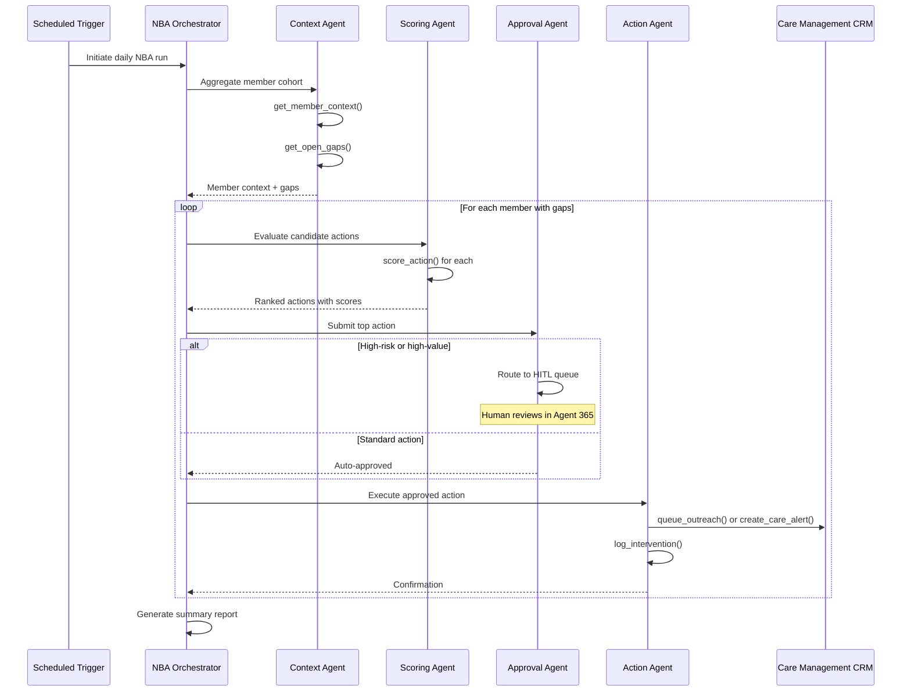

# Next Best Action (NBA) Agent Specification

## Overview

| Property | Value |
|----------|-------|
| **Spec ID** | `NBA-001` |
| **Version** | `1.0.0` |
| **Status** | `Active` |
| **Domain** | Healthcare Quality Management |
| **Agent Type** | Multi-Agent Orchestrated |
| **Governance Model** | Autonomous with HITL escalation |

## Business Framing

Healthcare organizations struggle to proactively manage quality, compliance, and care gaps across member populations. Traditional quality programs are retrospective, rules-heavy, and manual. The Digital Quality Management Next Best Action (NBA) Agent shifts quality operations from reactive reporting to proactive, continuous optimization.

### Value Proposition
The NBA Agent identifies the next best quality-driving actions for members, providers, and care teams based on real-time signals and predicted impact. It focuses scarce clinical and operational resources on the actions most likely to drive quality outcomes.

## Target Problems Addressed

| Problem | Impact | NBA Solution |
|---------|--------|--------------|
| Missed quality actions | HEDIS/STARS score reduction | Proactive gap identification |
| Fragmented workflows | Operational inefficiency | Unified orchestration |
| Manual prioritization | Delayed interventions | ML-based scoring |
| Limited visibility | Poor resource allocation | Continuous optimization |

## System Inputs

### Data Sources

| Source | Type | Refresh Rate | Purpose |
|--------|------|--------------|---------|
| Member Clinical Context | FHIR/HL7 | Near real-time | Health status, conditions |
| Claims Data | EDI 837/835 | Daily | Service history, gaps |
| Quality Measures | HEDIS specs | Quarterly | Measure compliance |
| Provider Attribution | Roster | Weekly | Care team assignment |
| Social Risk Indicators | SDOH | Monthly | Risk stratification |
| Action Effectiveness | Analytics | Weekly | Intervention success rates |

### Input Schema

```json
{
  "member_id": "string",
  "plan_id": "string",
  "measurement_year": "integer",
  "open_gaps": [
    {
      "measure_id": "string",
      "measure_name": "string",
      "gap_type": "string",
      "due_date": "date",
      "priority_score": "float"
    }
  ],
  "provider_context": {
    "attributed_provider_id": "string",
    "provider_capacity": "float",
    "last_visit_date": "date"
  },
  "member_context": {
    "risk_score": "float",
    "segment": "string",
    "contact_preferences": ["string"],
    "sdoh_flags": ["string"]
  }
}
```

## Multi-Agent Decomposition

### Agent Topology

```
┌─────────────────────────────────────────────────────────────────────┐
│                    NBA Orchestrator Agent                           │
│         Owns end-to-end goal and delegates tasks                    │
└────────────────────┬────────────────────────────────────────────────┘
                     │
    ┌────────────────┼────────────────┬────────────────┐
    ▼                ▼                ▼                ▼
┌─────────┐   ┌───────────┐   ┌───────────┐   ┌───────────┐
│ Context │   │  Scoring  │   │  Approval │   │  Action   │
│  Agent  │   │   Agent   │   │   Agent   │   │   Agent   │
└─────────┘   └───────────┘   └───────────┘   └───────────┘
```

### Agent Responsibilities

| Agent | Responsibility | Autonomy Level |
|-------|----------------|----------------|
| **NBA Orchestrator** | End-to-end workflow coordination | Full |
| **Context Aggregation** | Collect and normalize member/quality data | Full |
| **Scoring Agent** | Predict closure probability and quality lift | Full |
| **Approval Agent** | Apply governance rules, route for approval | HITL for high-risk |
| **Action Agent** | Execute or queue approved actions | Full (post-approval) |

## Architectural Alignment

### Control Plane Integration

| Component | Azure Service | Integration Pattern |
|-----------|---------------|---------------------|
| API Gateway | Azure API Management | MCP façade + policies |
| Agent Runtime | Azure Kubernetes Service | Workload identity |
| Memory - Short Term | CosmosDB | Session state |
| Memory - Long Term | Azure AI Search | Semantic search |
| Memory - Facts | Fabric IQ | Ontology-grounded |
| Orchestration | Azure AI Foundry | Agent Service |
| Identity | Microsoft Entra ID | Agent Identity |
| Observability | Azure Monitor + App Insights | OpenTelemetry |

### MCP Tool Catalog

| Tool Name | Description | Input Schema |
|-----------|-------------|--------------|
| `get_member_context` | Retrieve member clinical and risk context | `{ member_id: string }` |
| `get_open_gaps` | List open quality gaps for member | `{ member_id: string, measure_year: int }` |
| `score_action` | Predict closure probability for candidate action | `{ member_id: string, action_type: string }` |
| `queue_outreach` | Queue member outreach via preferred channel | `{ member_id: string, channel: string, message: string }` |
| `create_care_alert` | Create care team alert for provider | `{ provider_id: string, alert_type: string, member_id: string }` |
| `log_intervention` | Record intervention in member record | `{ member_id: string, intervention: object }` |

## Workflow Specification

### Primary Flow: Proactive Gap Closure



### Secondary Flow: Provider-Initiated Request

1. Provider requests NBA recommendation via Agent 365
2. Orchestrator receives request with member context
3. Context Agent retrieves latest data
4. Scoring Agent ranks available actions
5. Response delivered in real-time to provider

## Success Metrics (KPIs)

### Operational Metrics

| Metric | Target | Measurement |
|--------|--------|-------------|
| Care Gap Closure Rate | +15% vs baseline | Monthly cohort tracking |
| Time-to-Action | < 24 hours | Action timestamp delta |
| Outreach Effectiveness | > 30% engagement | Response tracking |
| Cost per Closed Gap | -20% vs baseline | Total cost / closures |

### Quality Metrics

| Metric | Target | Measurement |
|--------|--------|-------------|
| HEDIS Measure Attainment | > 4 STARS | Annual measure rates |
| Scoring Accuracy | > 0.80 AUC | Prediction vs actual |
| Task Adherence | > 0.90 score | Evaluation framework |
| Agent Safety | 0 violations | Content safety checks |

### Technical Metrics

| Metric | Target | Measurement |
|--------|--------|-------------|
| API Latency P95 | < 500ms | App Insights |
| Availability | 99.9% | Azure Monitor |
| Episode Capture Rate | 100% | Lightning metrics |
| Fine-tuning Lift | > 5% | A/B evaluation |

## Testing Requirements

### Unit Tests

| Test Category | Coverage Target | Description |
|---------------|-----------------|-------------|
| Context Aggregation | 90% | Data normalization logic |
| Scoring Models | 85% | Score calculation accuracy |
| Action Routing | 95% | Workflow branching logic |
| MCP Protocol | 100% | Tool schema compliance |

### Integration Tests

| Test Scenario | Validation |
|---------------|------------|
| End-to-end gap closure | Member receives outreach |
| HITL escalation | Action queued for approval |
| Provider request flow | Real-time response |
| Memory persistence | Cross-session recall |

### Evaluation Tests

| Evaluation | Framework | Threshold |
|------------|-----------|-----------|
| Task Adherence | Azure AI Foundry | > 0.90 |
| Content Safety | Azure Content Safety | 0 violations |
| Groundedness | RAG evaluation | > 0.85 |
| Response Quality | GPT-4 judge | > 0.80 |

## Fine-Tuning Specification

### Episode Capture

| Field | Description |
|-------|-------------|
| `episode_id` | Unique identifier |
| `agent_id` | NBA agent identifier |
| `session_id` | User session |
| `input_context` | Member data provided |
| `agent_actions` | Tool calls and responses |
| `outcome` | Final recommendation |
| `timestamp` | ISO 8601 |

### Reward Signals

| Signal | Source | Weight |
|--------|--------|--------|
| Gap Closed | CRM outcome | 1.0 |
| Outreach Engaged | Tracking | 0.5 |
| Provider Accepted | Feedback | 0.3 |
| Human Override | Agent 365 | -0.5 |

### Training Pipeline

1. Capture episodes during production operation
2. Label episodes with outcome-based rewards
3. Build training dataset with positive/negative examples
4. Fine-tune base model via Azure AI Foundry
5. Evaluate tuned model against baseline
6. Promote to production if evaluation passes

## Governance & Compliance

### HIPAA Considerations

| Requirement | Implementation |
|-------------|----------------|
| PHI Encryption | TLS 1.2+ in transit, AES-256 at rest |
| Access Audit | All queries logged to App Insights |
| Minimum Necessary | Agent receives only required data |
| BAA Coverage | Azure covered entity agreement |

### Human Oversight

| Scenario | Escalation Path |
|----------|-----------------|
| High-risk member | Route to care manager queue |
| First-time action type | Require supervisor approval |
| Scoring uncertainty | Present alternatives to human |
| Compliance flag | Block until compliance review |

## Dependencies

### Upstream Systems

| System | Integration | Failure Mode |
|--------|-------------|--------------|
| Member Data Lake | API | Graceful degradation |
| Claims Warehouse | API | Use cached data |
| Provider Directory | API | Static fallback |

### Downstream Systems

| System | Integration | SLA |
|--------|-------------|-----|
| Care Management CRM | MCP Tool | 99.9% |
| Member Portal | Webhook | 99.5% |
| Provider Dashboard | Event | 99.5% |

## Version History

| Version | Date | Author | Changes |
|---------|------|--------|---------|
| 1.0.0 | 2026-02-01 | Azure Agents Team | Initial specification |
