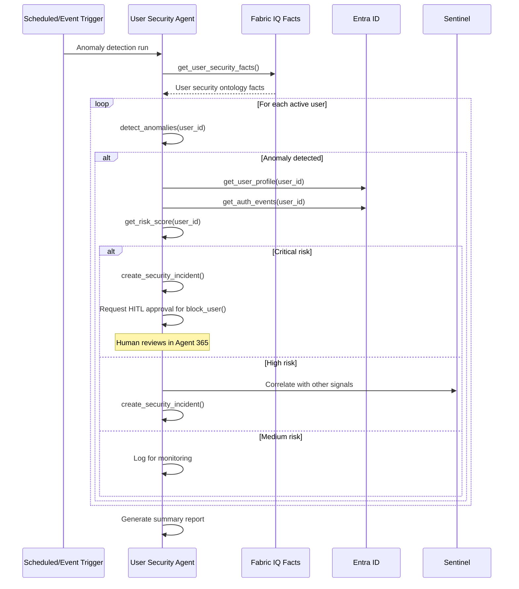

# User Management & Security Agent Specification

## Overview

| Property | Value |
|----------|-------|
| **Spec ID** | `UMS-001` |
| **Version** | `1.0.0` |
| **Status** | `Active` |
| **Domain** | Identity & Security |
| **Agent Type** | Single Agent with Tools |
| **Governance Model** | HITL for sensitive operations |

## Business Framing

Security operations teams manage user authentication, authorization, and access patterns across enterprise systems. Detecting anomalous behavior, investigating security incidents, and ensuring compliance with access policies requires continuous monitoring and rapid response. The User Management & Security Agent provides intelligent automation for security monitoring and access management.

### Value Proposition
The User Management & Security Agent shifts security operations from reactive incident response to proactive threat detection. It integrates with Fabric IQ for ontology-grounded security facts and provides actionable alerts for security teams.

## Target Problems Addressed

| Problem | Impact | Agent Solution |
|---------|--------|----------------|
| Delayed anomaly detection | Security breaches | Real-time pattern analysis |
| Manual log analysis | Slow investigation | AI-powered correlation |
| Access sprawl | Compliance risk | Automated access reviews |
| False positive alerts | Alert fatigue | Intelligent filtering |

## Agent Architecture

### Single Agent with Tool Orchestration

```
┌─────────────────────────────────────────────────────────────────────┐
│                  User Security Agent                                │
│         Orchestrates tools for security management                  │
└────────────────────┬────────────────────────────────────────────────┘
                     │
    ┌────────────────┼────────────────┬────────────────┐
    ▼                ▼                ▼                ▼
┌─────────┐   ┌───────────┐   ┌───────────┐   ┌───────────┐
│Security │   │  Entra    │   │  Sentinel │   │  Alert    │
│  Facts  │   │    ID     │   │   Logs    │   │   Mgmt    │
└─────────┘   └───────────┘   └───────────┘   └───────────┘
```

### Control Plane Integration

| Component | Azure Service | Integration Pattern |
|-----------|---------------|---------------------|
| API Gateway | Azure API Management | MCP façade |
| Agent Runtime | Azure Kubernetes Service | Workload identity |
| Facts Memory | Fabric IQ | User management domain |
| Identity | Microsoft Entra ID | Graph API |
| Security Logs | Microsoft Sentinel | KQL queries |
| Observability | Azure Monitor + App Insights | OpenTelemetry |

## MCP Tool Catalog

| Tool Name | Description | Input Schema |
|-----------|-------------|--------------|
| `get_user_security_facts` | Retrieve user security facts from Fabric IQ | `{ user_id: string, domain: "user_management" }` |
| `get_user_profile` | Get user profile from Entra ID | `{ user_id: string }` |
| `get_user_access` | Get user's current access assignments | `{ user_id: string }` |
| `get_auth_events` | Get authentication events for user | `{ user_id: string, time_range: string }` |
| `detect_anomalies` | Detect anomalous authentication patterns | `{ user_id: string }` |
| `get_risk_score` | Get user risk score from Identity Protection | `{ user_id: string }` |
| `investigate_alert` | Investigate security alert | `{ alert_id: string }` |
| `create_security_incident` | Create security incident | `{ severity: string, description: string, evidence: object }` |
| `request_access_review` | Initiate access review for user | `{ user_id: string, reason: string }` |
| `block_user` | Block user sign-in (requires approval) | `{ user_id: string, reason: string }` |

## Workflow Specification

### Primary Flow: Anomaly Detection and Response



### Secondary Flow: Access Review Automation

1. Scheduled trigger initiates access review cycle
2. Agent retrieves users with privileged access
3. Agent analyzes access patterns vs. actual usage
4. Agent identifies dormant or excessive permissions
5. Agent creates access review requests
6. Managers notified via Agent 365

### Tertiary Flow: Security Alert Investigation

1. Security alert webhook triggers agent
2. Agent retrieves alert details from Sentinel
3. Agent correlates with user facts from Fabric IQ
4. Agent investigates related authentication events
5. Agent generates investigation summary
6. Agent creates incident if confirmed threat

## Fabric IQ Facts Memory Integration

### User Management Domain Ontology

| Entity Type | Attributes | Relationships |
|-------------|------------|---------------|
| User | id, upn, department, role, status, risk_level | has_sessions, has_access |
| Session | id, start_time, end_time, ip_address, device | belongs_to_user |
| AuthEvent | id, timestamp, result, method, location | belongs_to_session |
| AccessAssignment | id, resource, permission, granted_date, last_used | assigned_to_user |
| SecurityAlert | id, severity, type, status, timestamp | triggered_by_user |

### Fact Types

| Fact Type | Example | Usage |
|-----------|---------|-------|
| `observation` | "User logged in from new location" | Current state |
| `prediction` | "User has 75% likelihood of compromise" | ML-derived |
| `derived` | "User has 5 unused admin permissions" | Calculated |
| `rule` | "MFA required for admin access" | Policy |

### Sample Facts Query

```json
{
  "query": "users with suspicious authentication patterns",
  "domain": "user_management",
  "filters": {
    "fact_type": "observation",
    "contains": "suspicious"
  },
  "limit": 100
}
```

## Success Metrics (KPIs)

### Security Metrics

| Metric | Target | Measurement |
|--------|--------|-------------|
| Mean Time to Detect | < 15 minutes | Alert timestamp delta |
| False Positive Rate | < 10% | Analyst feedback |
| Threat Detection Rate | > 95% | Red team validation |
| Access Review Completion | > 90% | Review tracking |

### Technical Metrics

| Metric | Target | Measurement |
|--------|--------|-------------|
| Anomaly Detection Accuracy | > 85% | Confusion matrix |
| API Latency P95 | < 500ms | App Insights |
| Facts Query Latency | < 200ms | Fabric IQ metrics |
| HITL Response Time | < 1 hour | Agent 365 metrics |

## Testing Requirements

### Unit Tests

| Test Category | Coverage Target | Description |
|---------------|-----------------|-------------|
| Anomaly Detection | 90% | Pattern matching logic |
| Risk Scoring | 85% | Score calculation |
| Facts Retrieval | 90% | Ontology query logic |
| MCP Protocol | 100% | Tool schema compliance |

### Integration Tests

| Test Scenario | Validation |
|---------------|------------|
| Anomaly alert creation | Incident created correctly |
| Access review request | Manager notified |
| User block (with approval) | User blocked after HITL |
| Cross-domain correlation | DevOps + customer impact |

### Evaluation Tests

| Evaluation | Framework | Threshold |
|------------|-----------|-----------|
| Anomaly Detection Accuracy | Labeled dataset | > 0.85 |
| Investigation Relevance | GPT-4 judge | > 0.80 |
| Groundedness | Fact verification | > 0.95 |

## Fine-Tuning Specification

### Episode Capture

| Field | Description |
|-------|-------------|
| `episode_id` | Unique identifier |
| `agent_id` | user-security-agent |
| `user_id` | Analyzed user |
| `trigger` | Event or scheduled |
| `input_facts` | Security facts provided |
| `analysis` | Anomaly analysis |
| `action_taken` | Alert, incident, block |
| `outcome` | Confirmed threat or false positive |

### Reward Signals

| Signal | Source | Weight |
|--------|--------|--------|
| True positive detection | Analyst confirmation | 1.0 |
| Threat mitigated | Incident resolution | 0.8 |
| False positive | Analyst feedback | -0.5 |
| Missed threat | Post-incident review | -1.0 |

## Governance & Compliance

### Privacy & Security

| Requirement | Implementation |
|-------------|----------------|
| PII Handling | Masked in logs |
| Data Access | Role-based, audited |
| Retention | 90-day analysis logs |
| Encryption | At rest and in transit |

### Human Oversight

| Scenario | Escalation Path |
|----------|-----------------|
| User block action | Requires manager approval |
| Mass access revocation | Requires CISO approval |
| New threat pattern | Security team review |
| Executive account alert | Immediate escalation |

### Compliance

| Standard | Requirement |
|----------|-------------|
| SOC 2 | Audit logging, access control |
| GDPR | Data minimization, consent |
| HIPAA | PHI access monitoring |
| PCI-DSS | Cardholder data protection |

## Version History

| Version | Date | Author | Changes |
|---------|------|--------|---------|
| 1.0.0 | 2026-02-01 | Azure Agents Team | Initial specification |
