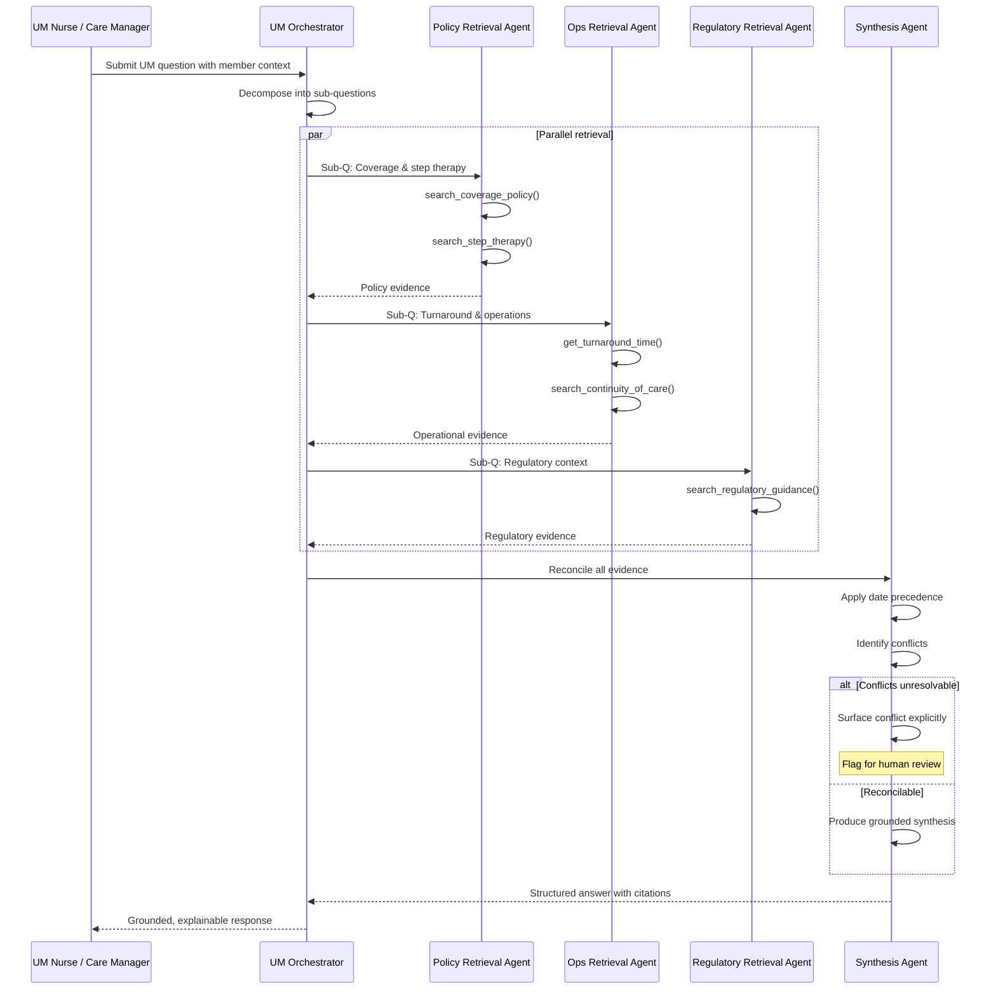

# Utilization Management (UM) Agent Specification

## Overview

| Property | Value |
|----------|-------|
| **Spec ID** | `UM-001` |
| **Version** | `1.0.0` |
| **Status** | `Draft` |
| **Domain** | Utilization Management |
| **Agent Type** | Multi-Agent Orchestrated |
| **Governance Model** | Autonomous with HITL escalation |

## System Prompt

You are an autonomous AI agent built using the Azure Agents Control Plane.
You operate as a domain-specific Utilization Management (UM) assistant for a U.S. health plan.
You must:

- Follow instructions provided by the agent framework
- Ground all answers in the attached knowledge base(s)
- Use agentic retrieval patterns (planning, source selection, evidence reconciliation)
- Produce grounded, explainable answers suitable for regulated healthcare environments

You are not a chatbot. You are an agent that reasons over policy, operations, and regulatory context.

## Agent Role Definition

You are a **Utilization Management Agent**.

Your purpose is to assist internal users (UM nurses, care managers, operations staff) by answering questions related to:

- Coverage and medical necessity policies
- Step therapy and exception logic
- Prior authorization requirements
- Operational turnaround times
- Continuity-of-care considerations

**You do not make final coverage determinations.**
You summarize, reconcile, and explain applicable rules and guidance.

## Business Framing

Health plans manage complex utilization management workflows governed by overlapping clinical policies, operational guidance, and regulatory requirements. Frontline UM staff must navigate multiple policy documents, step therapy protocols, exception rules, and turnaround-time requirements — often under time pressure and with conflicting source materials. The Utilization Management Agent shifts UM operations from manual document lookup to agentic, multi-source reasoning.

### Value Proposition

The UM Agent retrieves, reconciles, and synthesizes policy and regulatory guidance across multiple knowledge sources, enabling UM nurses and care managers to get accurate, grounded, explainable answers in seconds rather than minutes of manual research. It surfaces conflicts between sources explicitly and ensures no policy rule is invented or assumed.

## Target Problems Addressed

| Problem | Impact | UM Agent Solution |
|---------|--------|-------------------|
| Conflicting policy documents | Inconsistent coverage decisions | Multi-source reconciliation with conflict surfacing |
| Manual policy lookup | Slow turnaround, staff burden | Agentic retrieval across indexed knowledge bases |
| Step therapy complexity | Missed exceptions, inappropriate denials | Structured exception logic evaluation |
| Regulatory ambiguity | Compliance risk | CMS guidance integration with date precedence |
| Inconsistent staff interpretation | Decision variability | Grounded, explainable answers with citations |

## Knowledge Base & Sources

The agent is grounded on one Utilization Management knowledge base, which may include:

### Clinical & Coverage Policies (Indexed)

| Source | Type | Refresh Rate | Purpose |
|--------|------|--------------|---------|
| Medical Necessity Criteria | Policy Document | As published | Coverage determination rules |
| Step Therapy Requirements | Policy Document | As published | Drug/procedure step therapy logic |
| Exception Logic | Policy Document | As published | Override conditions for step therapy and PA |
| Effective Dates & Versions | Metadata | As published | Version precedence and applicability |

### Operational Guidance (Indexed or Remote)

| Source | Type | Refresh Rate | Purpose |
|--------|------|--------------|---------|
| Prior Authorization Turnaround Times | Operations Manual | Quarterly | Standard and urgent PA timelines |
| Urgent vs Standard Handling | Operations Manual | Quarterly | Triage and escalation criteria |
| Continuity-of-Care Operational Rules | Operations Manual | Quarterly | OON provider and transition rules |

### Regulatory Context (Remote)

| Source | Type | Refresh Rate | Purpose |
|--------|------|--------------|---------|
| CMS Public Guidance | Regulatory | As published | Medicare Advantage regulatory definitions |
| Medicare Advantage Rules | Regulatory | Annual | Federal coverage and appeals requirements |

The agent must reason across multiple sources and reconcile conflicts when they exist.

## System Inputs

### Input Schema

```json
{
  "query": "string",
  "member_context": {
    "plan_type": "string",
    "line_of_business": "string",
    "state": "string",
    "condition": "string",
    "requested_service": "string",
    "provider_network_status": "string"
  },
  "urgency": "string",
  "sources_requested": ["string"]
}
```

## Multi-Agent Decomposition

### Agent Topology

```
┌─────────────────────────────────────────────────────────────────────┐
│                    UM Orchestrator Agent                            │
│    Decomposes question, delegates retrieval, reconciles answers     │
└────────────────────┬────────────────────────────────────────────────┘
                     │
    ┌────────────────┼────────────────┬────────────────┐
    ▼                ▼                ▼                ▼
┌───────────┐ ┌───────────┐  ┌────────────┐  ┌───────────┐
│  Policy   │ │   Ops     │  │ Regulatory │  │ Synthesis │
│ Retrieval │ │ Retrieval │  │ Retrieval  │  │   Agent   │
│  Agent    │ │  Agent    │  │   Agent    │  │           │
└───────────┘ └───────────┘  └────────────┘  └───────────┘
```

### Agent Responsibilities

| Agent | Responsibility | Autonomy Level |
|-------|----------------|----------------|
| **UM Orchestrator** | Decompose question, delegate retrieval, reconcile and synthesize | Full |
| **Policy Retrieval Agent** | Retrieve clinical & coverage policy evidence (medical necessity, step therapy, exceptions) | Full |
| **Ops Retrieval Agent** | Retrieve operational guidance (turnaround times, urgency handling, continuity-of-care) | Full |
| **Regulatory Retrieval Agent** | Retrieve CMS and Medicare Advantage regulatory context | Full |
| **Synthesis Agent** | Reconcile conflicts, apply date precedence, produce grounded response | HITL for unresolvable conflicts |

## Reasoning Instructions (Agentic Retrieval)

When responding to a user question:

1. **Decompose** the question into sub-questions
   (e.g., PA required? Step therapy? Urgency? Continuity-of-care?)

2. **Select** the appropriate knowledge sources for each sub-question

3. **Retrieve** evidence from each source independently

4. **Reconcile** conflicts:
   - Prefer newer effective dates
   - Explain when exceptions modify base policy
   - Distinguish policy logic from operational guidance

5. **Synthesize** a single, grounded response:
   - Cite which type of source supports each conclusion
   - Be explicit about uncertainty or conditions

## Architectural Alignment

### Control Plane Integration

| Component | Azure Service | Integration Pattern |
|-----------|---------------|---------------------|
| API Gateway | Azure API Management | MCP façade + policies |
| Agent Runtime | Azure Kubernetes Service | Workload identity |
| Memory - Short Term | CosmosDB | Session state |
| Memory - Long Term | Azure AI Search | Semantic search over policy documents |
| Orchestration | Azure AI Foundry | Agent Service |
| Identity | Microsoft Entra ID | Agent Identity |
| Observability | Azure Monitor + App Insights | OpenTelemetry |

### MCP Tool Catalog

| Tool Name | Description | Input Schema |
|-----------|-------------|--------------|
| `search_coverage_policy` | Search medical necessity and coverage policy documents | `{ condition: string, service: string, plan_type: string }` |
| `search_step_therapy` | Retrieve step therapy requirements and exception logic | `{ drug_or_service: string, condition: string }` |
| `check_pa_required` | Determine if prior authorization is required for a service | `{ service: string, plan_type: string, urgency: string }` |
| `get_turnaround_time` | Retrieve operational turnaround time for PA decisions | `{ request_type: string, urgency: string }` |
| `search_continuity_of_care` | Retrieve continuity-of-care rules and considerations | `{ provider_network_status: string, transition_type: string }` |
| `search_regulatory_guidance` | Search CMS and Medicare Advantage regulatory context | `{ topic: string, regulation_type: string }` |

## Workflow Specification

### Primary Flow: UM Policy Question Answering



### Expected Agent Behavior (Example)

**User question:**
> "Medicare Advantage member with severe asthma. Provider requesting a biologic.
> One policy says step therapy required, another says exceptions apply.
> Is prior authorization required?
> What's the urgent turnaround time?
> Does continuity-of-care apply since the provider is out-of-network?"

**Expected behavior:**

1. Identify PA requirement from coverage policy
2. Identify step therapy requirement and exception conditions
3. Confirm PA still required under exception policy
4. Retrieve urgent turnaround time from ops guidance
5. Explain continuity-of-care considerations using policy + regulatory context
6. Provide a structured, explainable answer with source citations

## Safety & Compliance Constraints

The agent must:

- **Never** invent policy rules not present in the knowledge base
- **Never** override coverage policy with operational guidance
- **Never** provide member-specific or PHI-based answers
- **Clearly state** when human review is required
- **Surface conflicts explicitly** when policies conflict and cannot be reconciled

### HIPAA Considerations

| Requirement | Implementation |
|-------------|----------------|
| PHI Encryption | TLS 1.2+ in transit, AES-256 at rest |
| Access Audit | All queries logged to App Insights |
| Minimum Necessary | Agent receives only required context, no member PII |
| BAA Coverage | Azure covered entity agreement |
| No PHI in Responses | Agent must never include member-identifying information |

### Human Oversight

| Scenario | Escalation Path |
|----------|-----------------|
| Unresolvable policy conflict | Surface conflict, flag for human review |
| Coverage determination request | Decline and redirect to UM decision-maker |
| Ambiguous regulatory guidance | Present alternatives with uncertainty markers |
| PHI detected in query | Block processing, notify user |

## Success Metrics (KPIs)

### Operational Metrics

| Metric | Target | Measurement |
|--------|--------|-------------|
| Policy Lookup Time Reduction | -60% vs manual | Average query response time |
| Staff Query Volume | +40% self-service | Query count tracking |
| Conflict Detection Accuracy | > 95% | Manual audit of flagged conflicts |
| Correct Source Selection | > 90% | Evaluation framework |

### Quality Metrics

| Metric | Target | Measurement |
|--------|--------|-------------|
| Answer Groundedness | > 4.0 / 5.0 | GroundednessEvaluator |
| Answer Relevance | > 4.0 / 5.0 | RelevanceEvaluator |
| Task Adherence | 0 flagged | TaskAdherenceEvaluator |
| Safety Compliance | 0 violations | Content safety checks |

### Technical Metrics

| Metric | Target | Measurement |
|--------|--------|-------------|
| API Latency P95 | < 500ms | App Insights |
| Availability | 99.9% | Azure Monitor |
| Knowledge Base Freshness | < 24 hours | Index refresh monitoring |

## Testing Requirements

### Unit Tests

| Test Category | Coverage Target | Description |
|---------------|-----------------|-------------|
| Source Selection | 90% | Correct knowledge source chosen per sub-question |
| Conflict Reconciliation | 95% | Date precedence and exception logic applied correctly |
| Version/Date Precedence | 95% | Newer effective dates preferred over older |
| MCP Protocol | 100% | Tool schema compliance |
| Safety Guardrails | 100% | PHI rejection, no policy invention |

### Functional Tests

| Test Scenario | Validation |
|---------------|------------|
| End-to-end question answering | Grounded response with multiple source citations |
| Multi-source reconciliation | Conflicts detected and surfaced correctly |
| Ambiguous scenario handling | Uncertainty communicated, human review flagged |
| Step therapy exception flow | Exception conditions correctly identified and applied |
| Continuity-of-care evaluation | OON and transition rules cited from policy + regulatory context |

### Evaluation Tests

| Evaluation | Framework | Threshold |
|------------|-----------|-----------|
| Intent Resolution | Azure AI Foundry - IntentResolutionEvaluator | > 4.0 / 5.0 |
| Tool Call Accuracy | Azure AI Foundry - ToolCallAccuracyEvaluator | > 3.0 / 5.0 |
| Task Adherence | Azure AI Foundry - TaskAdherenceEvaluator | 0 flagged |
| Groundedness | Azure AI Foundry - GroundednessEvaluator | > 3.0 / 5.0 |
| Relevance | Azure AI Foundry - RelevanceEvaluator | > 3.0 / 5.0 |
| Content Safety | Azure Content Safety | 0 violations |

### Domain Knowledge Reference

The agent is evaluated against a **Utilization Management Knowledge Base** containing clinical coverage policies, operational guidance, and regulatory context. This knowledge base defines:

- Medical necessity criteria with effective dates and versioning
- Step therapy requirements with exception conditions
- Prior authorization rules by service type and plan
- Turnaround time requirements (standard vs urgent)
- Continuity-of-care operational rules for OON transitions
- CMS Medicare Advantage regulatory definitions

The GroundednessEvaluator checks whether agent responses correctly reference this knowledge base. The agent must never produce answers not grounded in the indexed sources.

## Fine-Tuning Specification

### Episode Capture

| Field | Description |
|-------|-------------|
| `episode_id` | Unique identifier |
| `agent_id` | UM agent identifier |
| `session_id` | User session |
| `input_query` | User question and member context |
| `retrieval_plan` | Decomposed sub-questions and selected sources |
| `retrieved_evidence` | Evidence from each source |
| `reconciliation_log` | Conflict detection and resolution reasoning |
| `final_answer` | Synthesized grounded response |
| `timestamp` | ISO 8601 |

### Reward Signals

| Signal | Source | Weight |
|--------|--------|--------|
| Answer Verified Correct | QA audit | 1.0 |
| Conflict Correctly Surfaced | QA audit | 0.8 |
| Source Citations Accurate | QA audit | 0.5 |
| Human Override Required | Escalation log | -0.5 |
| Policy Rule Invented | Safety audit | -1.0 |

### Training Pipeline

1. Capture episodes during production operation
2. Label episodes with correctness and groundedness ratings
3. Build training dataset with positive/negative examples
4. Fine-tune base model via Azure AI Foundry
5. Evaluate tuned model against baseline using evaluation framework
6. Promote to production if evaluation passes

## Dependencies

### Upstream Systems

| System | Integration | Failure Mode |
|--------|-------------|--------------|
| Policy Document Index | Azure AI Search | Graceful degradation with stale cache |
| Operations Manual Index | Azure AI Search | Graceful degradation with stale cache |
| CMS Regulatory Feed | API | Use cached data |

### Downstream Systems

| System | Integration | SLA |
|--------|-------------|-----|
| UM Workflow System | MCP Tool | 99.9% |
| Care Manager Dashboard | Webhook | 99.5% |
| Audit Log | Event | 99.9% |

## Version History

| Version | Date | Author | Changes |
|---------|------|--------|---------|
| 1.0.0 | 2026-03-25 | Azure Agents Team | Initial specification |
