# Azure Agents Control Plane

The Azure Agents Control Plane governs the complete lifecycle of enterprise AI agents: analysis, design, development, testing, fine-tuning, and evaluation. It enables enterprise-grade AI agent development where Azure provides centralized governance, observability, identity, and compliance—regardless of agent execution location.

**Core Principles:**
- **Azure as Enterprise Control Plane** - Centralized governance with single or multi-cloud execution capability
- **Specification-Driven Development** - SpecKit methodology ensures structured analysis, design, testing, fine tuning and evaluations
- **API-First Agent Architecture** - All agent operations flow through Azure API Management with Model Context Protocol (MCP) defining capabilities
- **Identity-First Security** - Every agent receives a Microsoft Entra ID Agent identity with least-privilege role based authorization control (RBAC)
- **Continuous Evaluation & Improvement** - Agent Lightning enables fine-tuning through reinforcement learning



For detailed architecture diagrams and component specifications, see [docs/AGENTS_AKS_ARCHITECTURE.md](docs/AGENTS_AKS_ARCHITECTURE.md).

---

## Agent Specifications (SpecKit)

This project follows the [SpecKit Methodology](https://speckit.dev) for agent governance. Specifications are stored in `.speckit/` and define:

- **Constitution** - Core principles, standards, and governance framework
- **Agent Specifications** - Use case analysis, design, implementation, testing, fine-tuning, and evaluation for each agent

### Governance Model

| Agent Type | Description |
|------------|-------------|
| **Single Agent** | One agent with multiple tools |
| **Multi-Agent Orchestrated** | Multiple specialized agents working together |
| **Multi-Agent with Approvals** | Orchestrated agents with human oversight |

### Autonomy Levels

| Level | Description |
|-------|-------------|
| **Full Autonomous** | Agent operates without human approval |
| **Semi Autonomous** | Human approval for specific conditions |
| **Not Autonomous** | Every action requires approval |

---

## Deployment

### Prerequisites

- [Azure CLI](https://learn.microsoft.com/cli/azure/install-azure-cli)
- [Azure Developer CLI](https://learn.microsoft.com/azure/developer/azure-developer-cli/install-azd)
- [kubectl](https://kubernetes.io/docs/tasks/tools/)
- [Docker](https://docs.docker.com/get-docker/)

### Quick Start

```bash
azd auth login
azd up
```

The `azd up` command deploys all infrastructure and automatically configures:
- AKS cluster with Container Registry
- API Management with OAuth endpoints
- MCP server deployment with workload identity
- LoadBalancer service connected to APIM backend

### Two-Phase Deployment (with Agent Identity)

For deployments requiring Entra Agent Identity:

```powershell
# Phase 1: Core Infrastructure
azd auth login
azd env set AZURE_AGENT_IDENTITY_ENABLED false
azd up --no-prompt

# Phase 2: Enable Agent Identity
azd env set AZURE_AGENT_IDENTITY_ENABLED true
azd provision --no-prompt
```

---

## Verification

```bash
# Verify pods
kubectl get pods -n mcp-agents

# Verify LoadBalancer
kubectl get svc -n mcp-agents mcp-agents-loadbalancer

# Run integration tests
python tests/test_apim_mcp_connection.py --use-az-token
```

---

## Documentation

| Document | Description |
|----------|-------------|
| [AGENTS_AKS_ARCHITECTURE.md](docs/AGENTS_AKS_ARCHITECTURE.md) | System architecture and component diagrams |
| [AGENTS_AKS_DEPLOYMENT_NOTES.md](docs/AGENTS_AKS_DEPLOYMENT_NOTES.md) | Detailed deployment notes |
| [AGENTS_AKS_IDENTITY_DESIGN.md](docs/AGENTS_AKS_IDENTITY_DESIGN.md) | Identity architecture design |
| [AGENTS_AKS_AGENT_LIGHTNING_DESIGN.md](docs/AGENTS_AKS_AGENT_LIGHTNING_DESIGN.md) | Fine-tuning and RL documentation |
| [AGENTS_AKS_AGENT_LIGHTNING_TEST_RESULTS.md](docs/AGENTS_AKS_AGENT_LIGHTNING_TEST_RESULTS.md) | Lightning test results |
| [AGENTS_AKS_EVALUATIONS.md](docs/AGENTS_AKS_EVALUATIONS.md) | Agent evaluation framework |
| [AGENTS_AKS_TEST_RESULTS.md](docs/AGENTS_AKS_TEST_RESULTS.md) | Integration test results |

---

## References

### Azure Services
- [Azure AI Foundry](https://learn.microsoft.com/azure/ai-foundry)
- [Azure AI Search](https://learn.microsoft.com/azure/search/)
- [Azure API Management](https://learn.microsoft.com/azure/api-management/)
- [Azure Bicep](https://learn.microsoft.com/azure/azure-resource-manager/bicep/)
- [Azure CLI](https://learn.microsoft.com/cli/azure/)
- [Azure Container Registry](https://learn.microsoft.com/azure/container-registry/)
- [Azure Cosmos DB](https://learn.microsoft.com/azure/cosmos-db/)
- [Azure Developer CLI (azd)](https://learn.microsoft.com/azure/developer/azure-developer-cli/)
- [Azure Kubernetes Service (AKS)](https://learn.microsoft.com/azure/aks/)
- [Azure Storage](https://learn.microsoft.com/azure/storage/)
- [Foundry IQ](https://learn.microsoft.com/azure/ai-services/agents/concepts/foundry-iq)
- [Microsoft Fabric](https://learn.microsoft.com/fabric/)
- [Microsoft Fabric IQ](https://learn.microsoft.com/fabric/get-started/fabric-iq)

### Identity & Security
- [Microsoft Entra ID](https://learn.microsoft.com/entra/identity/)
- [Microsoft Entra Agent Identity](https://learn.microsoft.com/entra/workload-id/)
- [Workload Identity Federation](https://learn.microsoft.com/azure/aks/workload-identity-overview)

### Agent Frameworks & Tools
- [Agent Lightning](docs/AGENTS_AKS_AGENT_LIGHTNING_DESIGN.md) - Fine-tuning and reinforcement learning
- [Agents 365](https://learn.microsoft.com/microsoft-365-copilot/extensibility/) - Human-in-the-Loop integration
- [MCP Inspector](https://github.com/modelcontextprotocol/inspector)
- [Microsoft Agent Framework](https://learn.microsoft.com/azure/ai-services/agents/)
- [Model Context Protocol](https://modelcontextprotocol.io)
- [SpecKit Methodology](https://speckit.dev)

### Python Frameworks
- [aiohttp](https://docs.aiohttp.org/)
- [Azure Identity SDK](https://learn.microsoft.com/python/api/azure-identity/)
- [Azure AI Evaluation SDK](https://learn.microsoft.com/azure/ai-studio/how-to/develop/evaluate-sdk)
- [Azure Cosmos SDK](https://learn.microsoft.com/python/api/azure-cosmos/)
- [Azure Search Documents SDK](https://learn.microsoft.com/python/api/azure-search-documents/)
- [Azure Storage Blob SDK](https://learn.microsoft.com/python/api/azure-storage-blob/)
- [FastAPI](https://fastapi.tiangolo.com/)
- [NumPy](https://numpy.org/)
- [Pydantic](https://docs.pydantic.dev/)
- [Python](https://www.python.org/)
- [python-dotenv](https://pypi.org/project/python-dotenv/)
- [Uvicorn](https://www.uvicorn.org/)

### DevOps Tools
- [Docker](https://docs.docker.com/)
- [kubectl](https://kubernetes.io/docs/reference/kubectl/)
