# Azure Agents Control Plane

The Azure Agents Control Plane governs the complete lifecycle of enterprise AI agents: analysis, design, development, testing, fine-tuning, and evaluation. It enables enterprise-grade AI agent development where Azure provides centralized governance, observability, identity, and compliance—regardless of agent execution location.

**Core Principles:**

- **Azure as Enterprise Control Plane** - Centralized governance with single or multi-cloud execution capability
- **Specification-Driven Development** - SpecKit methodology ensures structured analysis, design, testing, fine tuning and evaluations
- **API-First Agent Architecture** - All agent operations flow through Azure API Management with Model Context Protocol (MCP) defining capabilities
- **Identity-First Security** - Every agent receives a Microsoft Entra ID Agent identity with least-privilege role based authorization control (RBAC)
- **Continuous Evaluation & Improvement** - Agent Lightning enables fine-tuning through reinforcement learning

The following two animations show the system architecture at runtime and buildtime.

### Runtime Architecture

Runtime Architecture - Describes the request flow through API Management to AKS, workload identity, connections to AI Foundry, Cosmos DB, AI Search, Storage, Agent Lightning, and Fabric with observability through Monitor and App Insights.


### Buildtime Architecture

Buildtime Architecture - Describes the developer workflow with VS Code, GitHub Copilot, SpecKit methodology, Python ecosystem, GitHub Actions CI/CD with parallel App Build and Infra Build tracks, deployment to Azure with human-in-the-loop approvals.



For detailed architecture diagrams and component specifications, see [docs/AGENTS_ARCHITECTURE.md](docs/AGENTS_ARCHITECTURE.md).

---

## Agent Specifications (SpecKit)

This project follows the [SpecKit Methodology](https://speckit.dev) for agent governance. Specifications are stored in `.speckit/` and define:

- **Constitution** - Core principles, standards, and governance framework
- **Agent Specifications** - Use case analysis, design, implementation, testing, fine-tuning, and evaluation for each agent

### Governance Model

| Agent Type                     | Description                                  |
| ------------------------------ | -------------------------------------------- |
| **Single Agent**               | One agent with multiple tools                |
| **Multi-Agent Orchestrated**   | Multiple specialized agents working together |
| **Multi-Agent with Approvals** | Orchestrated agents with human oversight     |

### Autonomy Levels

| Level               | Description                            |
| ------------------- | -------------------------------------- |
| **Full Autonomous** | Agent operates without human approval  |
| **Semi Autonomous** | Human approval for specific conditions |
| **Not Autonomous**  | Every action requires approval         |

---

## Deployment

### Prerequisites

#### Development Tools

- [Python 3.11+](https://www.python.org/downloads/)
- [pip](https://pip.pypa.io/en/stable/installation/)
- [uv](https://docs.astral.sh/uv/getting-started/installation/)
- [VS Code](https://code.visualstudio.com/download)
- [GitHub Copilot](https://github.com/features/copilot) with premium coding models (GPT-5.2-Codex, Claude 4.5 Opus, Sonnet)

#### Azure & Container Tools

- [Azure CLI](https://learn.microsoft.com/cli/azure/install-azure-cli)
- [Azure Developer CLI](https://learn.microsoft.com/azure/developer/azure-developer-cli/install-azd)
- [kubectl](https://kubernetes.io/docs/tasks/tools/) (with [port-forward](https://kubernetes.io/docs/reference/kubectl/generated/kubectl_port-forward/) capability)
- [Docker Desktop](https://docs.docker.com/desktop/)

#### Azure Access Requirements

- Azure Subscription with Owner privileges (recommended)
- Quota for compute used in AKS node pool VMs
- Quota for language and embedding models in [Azure AI Foundry](https://learn.microsoft.com/azure/ai-foundry)
- Ability to configure [Agents 365](https://learn.microsoft.com/microsoft-365-copilot/extensibility/) integration
- Access to [Microsoft Fabric Workspace](https://learn.microsoft.com/fabric/) and [Fabric IQ](https://learn.microsoft.com/fabric/get-started/fabric-iq)

### Quick Start

```bash
azd auth login
azd up
```

The `azd up` command deploys all infrastructure and automatically configures:

- AKS cluster with Container Registry
- API Management with OAuth endpoints
- MCP server deployment with workload identity
- LoadBalancer service connected to APIM backend

### Two-Phase Deployment (with Agent Identity)

For deployments requiring Entra Agent Identity:

```powershell
# Phase 1: Core Infrastructure
azd auth login
azd env set AZURE_AGENT_IDENTITY_ENABLED false
azd up --no-prompt

# Phase 2: Enable Agent Identity
azd env set AZURE_AGENT_IDENTITY_ENABLED true
azd provision --no-prompt
```

---

## Security Configuration

### Microsoft Defender for Cloud

The infrastructure includes optional Microsoft Defender for Cloud integration to provide continuous security assessment, threat protection, and compliance monitoring for Azure resources.

**Defender Plans Included:**
- **Defender for Containers** - Protects AKS clusters and container registries with vulnerability assessments
- **Defender for Key Vault** - Detects unusual access patterns to secrets
- **Defender for Azure Cosmos DB** - Monitors database threats and anomalies
- **Defender for APIs** - Secures API Management endpoints
- **Defender for Resource Manager** - Monitors control plane operations

**Configuration:**

To enable Defender for Cloud, set the following environment variables before deployment:

```bash
# Enable Defender for Cloud
azd env set DEFENDER_ENABLED true

# Set security contact for alert notifications (required)
azd env set DEFENDER_SECURITY_CONTACT_EMAIL "security@example.com"

# Optional: Set security contact phone number
azd env set DEFENDER_SECURITY_CONTACT_PHONE "+1-555-0100"
```

The Defender module will automatically:
- Enable selected Defender plans at the subscription level
- Configure security contact for alert notifications
- Enable auto-provisioning of monitoring agents
- Send alerts for medium and higher severity issues

**Note:** Defender for Cloud incurs additional costs. Review [Microsoft Defender for Cloud pricing](https://azure.microsoft.com/pricing/details/defender-for-cloud/) before enabling.

---

## Verification

```bash
# Verify pods
kubectl get pods -n mcp-agents

# Verify LoadBalancer
kubectl get svc -n mcp-agents mcp-agents-loadbalancer

# Run integration tests
python tests/test_apim_mcp_connection.py --use-az-token
```

---

## Documentation

| Document                                                                              | Description                                      |
| ------------------------------------------------------------------------------------- | ------------------------------------------------ |
| [AGENTS_ARCHITECTURE.md](docs/AGENTS_ARCHITECTURE.md)                                 | System architecture and component diagrams       |
| [AGENTS_APPROVALS.md](docs/AGENTS_APPROVALS.md)                                       | Agent 365 approvals and human-in-the-loop (HITL) |
| [AGENTS_DEPLOYMENT_NOTES.md](docs/AGENTS_DEPLOYMENT_NOTES.md)                         | Detailed deployment notes                        |
| [AGENTS_IDENTITY_DESIGN.md](docs/AGENTS_IDENTITY_DESIGN.md)                           | Identity architecture design                     |
| [AGENTS_AGENT_LIGHTNING_DESIGN.md](docs/AGENTS_AGENT_LIGHTNING_DESIGN.md)             | Fine-tuning and RL documentation                 |
| [AGENTS_AGENT_LIGHTNING_TEST_RESULTS.md](docs/AGENTS_AGENT_LIGHTNING_TEST_RESULTS.md) | Lightning test results                           |
| [AGENTS_EVALUATIONS.md](docs/AGENTS_EVALUATIONS.md)                                   | Agent evaluation framework                       |
| [AGENTS_TEST_RESULTS.md](docs/AGENTS_TEST_RESULTS.md)                                 | Integration test results                         |
| [DEFENDER_FOR_CLOUD_TESTING.md](docs/DEFENDER_FOR_CLOUD_TESTING.md)                   | Defender for Cloud deployment and testing guide  |

---

## References

### Azure Services

- [Azure AI Foundry](https://learn.microsoft.com/azure/ai-foundry)
- [Azure AI Search](https://learn.microsoft.com/azure/search/)
- [Azure API Management](https://learn.microsoft.com/azure/api-management/)
- [Azure Bicep](https://learn.microsoft.com/azure/azure-resource-manager/bicep/)
- [Azure CLI](https://learn.microsoft.com/cli/azure/)
- [Azure Container Registry](https://learn.microsoft.com/azure/container-registry/)
- [Azure Cosmos DB](https://learn.microsoft.com/azure/cosmos-db/)
- [Azure Developer CLI (azd)](https://learn.microsoft.com/azure/developer/azure-developer-cli/)
- [Azure Kubernetes Service (AKS)](https://learn.microsoft.com/azure/aks/)
- [Azure Storage](https://learn.microsoft.com/azure/storage/)
- [Foundry IQ](https://learn.microsoft.com/azure/ai-services/agents/concepts/foundry-iq)
- [Microsoft Fabric](https://learn.microsoft.com/fabric/)
- [Microsoft Fabric IQ](https://learn.microsoft.com/fabric/get-started/fabric-iq)

### Identity & Security

- [Microsoft Entra ID](https://learn.microsoft.com/entra/identity/)
- [Microsoft Entra Agent Identity](https://learn.microsoft.com/entra/workload-id/)
- [Workload Identity Federation](https://learn.microsoft.com/azure/aks/workload-identity-overview)
- [Microsoft Defender for Cloud](https://learn.microsoft.com/azure/defender-for-cloud/)

### Agent Frameworks & Tools

- [Agent Lightning](docs/AGENTS_AGENT_LIGHTNING_DESIGN.md) - Fine-tuning and reinforcement learning
- [Agents 365](https://learn.microsoft.com/microsoft-365-copilot/extensibility/) - Human-in-the-Loop integration
- [MCP Inspector](https://github.com/modelcontextprotocol/inspector)
- [Microsoft Agent Framework](https://learn.microsoft.com/azure/ai-services/agents/)
- [Model Context Protocol](https://modelcontextprotocol.io)
- [SpecKit Methodology](https://speckit.dev)

### Python Frameworks

- [aiohttp](https://docs.aiohttp.org/)
- [Azure Identity SDK](https://learn.microsoft.com/python/api/azure-identity/)
- [pip](https://pip.pypa.io/)
- [Azure AI Evaluation SDK](https://learn.microsoft.com/azure/ai-studio/how-to/develop/evaluate-sdk)
- [Azure Cosmos SDK](https://learn.microsoft.com/python/api/azure-cosmos/)
- [Azure Search Documents SDK](https://learn.microsoft.com/python/api/azure-search-documents/)
- [Azure Storage Blob SDK](https://learn.microsoft.com/python/api/azure-storage-blob/)
- [FastAPI](https://fastapi.tiangolo.com/)
- [NumPy](https://numpy.org/)
- [Pydantic](https://docs.pydantic.dev/)
- [Python](https://www.python.org/)
- [python-dotenv](https://pypi.org/project/python-dotenv/)
- [Uvicorn](https://www.uvicorn.org/)

### DevOps Tools

- [Docker Desktop](https://docs.docker.com/desktop/)
- [GitHub Copilot](https://github.com/features/copilot)
- [kubectl](https://kubernetes.io/docs/reference/kubectl/)
- [uv](https://docs.astral.sh/uv/)
- [VS Code](https://code.visualstudio.com/)
