# System Architecture

This document provides comprehensive Mermaid diagrams for the AI Agents with AKS and APIM solution.

## Table of Contents

1. [Component Architecture Diagram](#component-architecture-diagram)
2. [Detailed Component Diagram](#detailed-component-diagram)
3. [Memory Architecture](#memory-architecture)
   - [Memory Components](#memory-components)
   - [Facts Memory - Fabric IQ Integration](#facts-memory---fabric-iq-integration)
   - [Domain Ontologies](#domain-ontologies)
   - [Cross-Domain Reasoning](#cross-domain-reasoning)
   - [Memory Flow](#memory-flow)
4. [Deployment Architecture](#deployment-architecture)
   - [Fabric Infrastructure Details](#fabric-infrastructure-details)
   - [Fabric Data Agents](#fabric-data-agents)
5. [Sequence Diagrams](#sequence-diagrams)
   - [Agent Authentication Flow](#agent-authentication-flow)
   - [MCP Tool Discovery](#mcp-tool-discovery)
   - [MCP Tool Execution](#mcp-tool-execution)
6. [Activity Diagrams](#activity-diagrams)
   - [Deployment Process](#deployment-process-activity-diagram)
   - [Request Processing](#request-processing-activity-diagram)

---

## Component Architecture Diagram

High-level component view of the entire system:

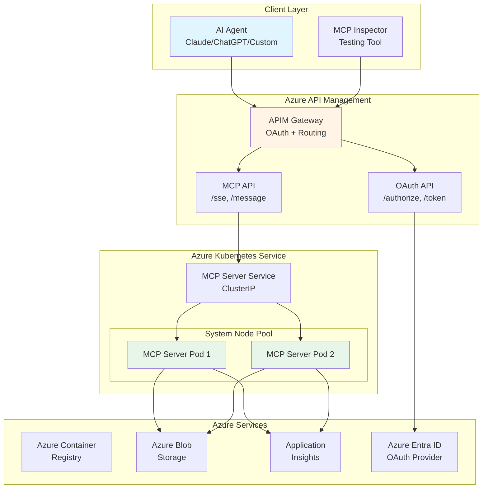

---

## Detailed Component Diagram

Detailed view showing all components, their responsibilities, and interactions:

```mermaid
graph TB
    subgraph "AI Agent Client"
        AgentCore[Agent Core Engine]
        MCPClient[MCP Client Library]
        AgentCore --> MCPClient
    end

    subgraph "Azure API Management Layer"
        subgraph "OAuth Components"
            AuthEndpoint[/authorize Endpoint]
            TokenEndpoint[/token Endpoint]
            RegisterEndpoint[/register Endpoint]
            WellKnown[/.well-known<br/>OAuth Metadata]
        end
        
        subgraph "MCP Components"
            SSEEndpoint[/sse Endpoint<br/>Server-Sent Events]
            MessageEndpoint[/message Endpoint<br/>JSON-RPC 2.0]
        end
        
        subgraph "APIM Policies"
            AuthPolicy[Authentication Policy<br/>OAuth Token Validation]
            RateLimitPolicy[Rate Limiting Policy]
            CORSPolicy[CORS Policy]
            BackendPolicy[Backend Routing Policy]
        end
    end

    subgraph "AKS Cluster - System Node Pool"
        subgraph "MCP Server Deployment"
            subgraph "Pod 1"
                FastAPI1[FastAPI App]
                SSEHandler1[SSE Handler<br/>Async Streaming]
                MCPTools1[MCP Tool Executor<br/>hello, get, save]
                StorageClient1[Azure Storage SDK]
            end
            
            subgraph "Pod 2"
                FastAPI2[FastAPI App]
                SSEHandler2[SSE Handler]
                MCPTools2[MCP Tool Executor]
                StorageClient2[Azure Storage SDK]
            end
        end
        
        K8sService[Kubernetes Service<br/>Load Balancer]
        ServiceAccount[Service Account<br/>Workload Identity]
    end

    subgraph "Azure Container Registry"
        MCPImage[MCP Server Image<br/>mcp-agents:latest]
    end

    subgraph "Azure Storage"
        SnippetsContainer[snippets Container<br/>Blob Storage]
        DeploymentContainer[deployment Container<br/>Code Packages]
    end

    subgraph "Monitoring & Identity"
        AppInsightsSDK[App Insights SDK<br/>Telemetry]
        ManagedIdentity[Managed Identity<br/>AAD Integration]
        LogAnalytics[Log Analytics<br/>Workspace]
    end

    MCPClient --> SSEEndpoint
    MCPClient --> MessageEndpoint
    SSEEndpoint --> AuthPolicy
    MessageEndpoint --> AuthPolicy
    AuthPolicy --> RateLimitPolicy
    RateLimitPolicy --> BackendPolicy
    BackendPolicy --> K8sService
    
    K8sService --> FastAPI1
    K8sService --> FastAPI2
    
    FastAPI1 --> SSEHandler1
    FastAPI1 --> MCPTools1
    MCPTools1 --> StorageClient1
    StorageClient1 --> SnippetsContainer
    
    FastAPI2 --> SSEHandler2
    FastAPI2 --> MCPTools2
    MCPTools2 --> StorageClient2
    StorageClient2 --> SnippetsContainer
    
    ServiceAccount --> ManagedIdentity
    ManagedIdentity --> SnippetsContainer
    
    ACR --> MCPImage
    
    FastAPI1 --> AppInsightsSDK
    FastAPI2 --> AppInsightsSDK
    AppInsightsSDK --> LogAnalytics
    
    AuthEndpoint --> ManagedIdentity

    style AgentCore fill:#e1f5ff
    style APIM fill:#fff4e6
    style FastAPI1 fill:#e8f5e9
    style FastAPI2 fill:#e8f5e9
```

---

## Memory Architecture

The MCP Agent uses a composite memory system combining short-term session memory, long-term persistent memory, and ontology-grounded facts memory for semantic reasoning:

```
┌─────────────────────────────────────────────────────────────────────────────────┐
│                              CompositeMemory                                    │
├─────────────────────────────────────────────────────────────────────────────────┤
│  ┌─────────────────────┐  ┌─────────────────────┐  ┌─────────────────────────┐ │
│  │  Short-Term Memory  │  │   Long-Term Memory  │  │     Facts Memory        │ │
│  │    (CosmosDB)       │  │   (AI Search)       │  │    (Fabric IQ)          │ │
│  │  - Session-based    │  │  - Persistent       │  │  - Ontology-grounded    │ │
│  │  - TTL support      │  │  - Cross-session    │  │  - Cross-domain         │ │
│  │  - Fast access      │  │  - Hybrid search    │  │  - Entity relationships │ │
│  └─────────────────────┘  └─────────────────────┘  └─────────────────────────┘ │
└─────────────────────────────────────────────────────────────────────────────────┘
```

### Memory Components

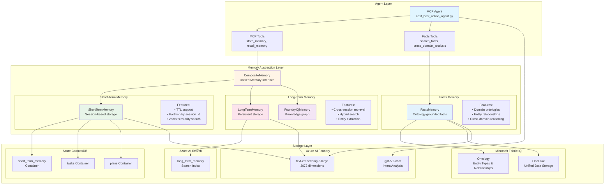

### Facts Memory - Fabric IQ Integration

The Facts Memory provider integrates with [Microsoft Fabric IQ](https://learn.microsoft.com/en-us/fabric/iq/overview) to provide ontology-grounded facts for AI agent reasoning. It organizes data according to business language and exposes it with consistent semantic meaning.

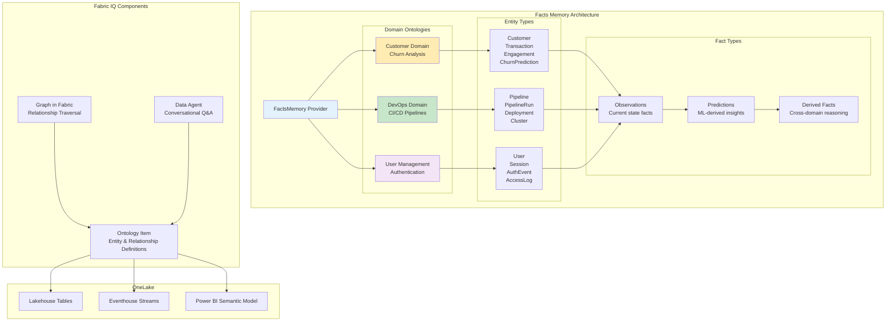

### Domain Ontologies

| Domain | Entity Types | Use Cases |
|--------|--------------|-----------|
| **Customer** | Customer, Transaction, Engagement, ChurnPrediction | Customer churn analysis, predictive modeling, at-risk identification |
| **DevOps** | Pipeline, PipelineRun, Deployment, Cluster | CI/CD monitoring, failure analysis, deployment tracking |
| **User Management** | User, Session, AuthEvent, AccessLog | Security monitoring, access patterns, authentication analysis |

### Fact Types

| Fact Type | Description | Example |
|-----------|-------------|---------|
| `observation` | Current state of an entity | "Pipeline 'api-gateway' has 93% success rate" |
| `prediction` | ML-derived forecast | "Customer 'Liam' has 82% churn risk" |
| `derived` | Cross-domain insight | "Deployment failures correlate with high-risk customers" |
| `rule` | Business rule fact | "MFA required for admin access" |

### Cross-Domain Reasoning

Facts Memory enables cross-domain analysis to find connections between different business domains:

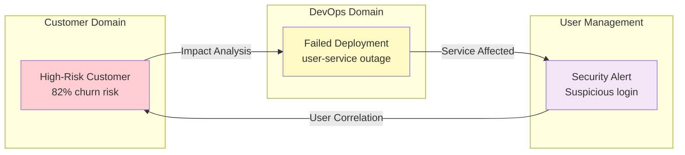

### Memory Flow

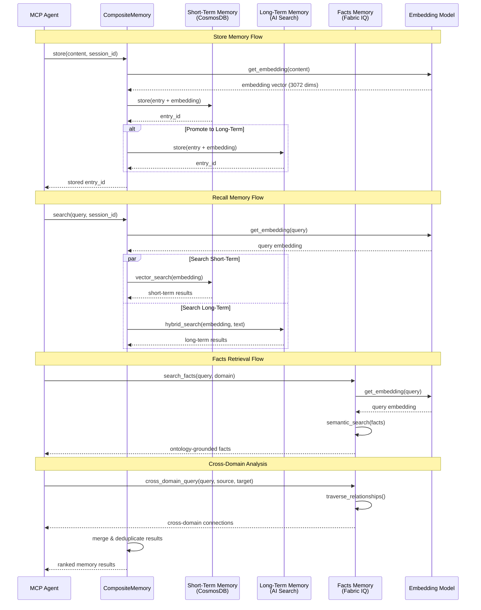

### Memory Types

| Type | Description | Use Case |
|------|-------------|----------|
| `TASK` | Task descriptions with embeddings | Semantic task matching |
| `PLAN` | Generated action plans | Plan reuse and learning |
| `CONVERSATION` | Chat messages | Session history |
| `CONTEXT` | General context | User preferences, state |
| `EMBEDDING` | Raw embeddings | Vector operations |

### Fact Types (Fabric IQ)

| Type | Description | Use Case |
|------|-------------|----------|
| `observation` | Current state facts | "Pipeline has 93% success rate" |
| `prediction` | ML-derived forecasts | "Customer has 82% churn risk" |
| `derived` | Cross-domain insights | Correlation analysis |
| `rule` | Business rules | Policy enforcement |

### CosmosDB Container Schema

**short_term_memory container:**
```json
{
  "id": "uuid",
  "content": "memory content text",
  "memory_type": "context|conversation|task|plan",
  "embedding": [0.123, ...],  // 3072 dimensions
  "session_id": "partition key",
  "user_id": "optional user identifier",
  "metadata": {},
  "created_at": "ISO timestamp",
  "updated_at": "ISO timestamp",
  "ttl": 3600  // Time-to-live in seconds
}
```

### Fabric IQ Fact Schema

**Facts in FactsMemory:**
```json
{
  "id": "fact-churn-cust-123",
  "fact_type": "prediction",
  "domain": "customer",
  "statement": "Customer 'Liam' has 82% churn risk",
  "confidence": 0.82,
  "evidence": ["cust-123", "tx-456"],
  "context": {
    "segment": "business",
    "risk_level": "critical",
    "tenure_months": 8
  },
  "embedding": [0.123, ...],
  "created_at": "ISO timestamp",
  "valid_until": "ISO timestamp"
}
```

### MCP Memory Tools

| Tool | Description |
|------|-------------|
| `store_memory` | Store content with embedding in short-term memory |
| `recall_memory` | Semantic search for relevant memories |
| `get_session_history` | Retrieve conversation history |
| `clear_session_memory` | Clear session memory |
| `next_best_action` | Analyze task, find similar tasks, generate plan |

### MCP Facts Memory Tools (Fabric IQ)

| Tool | Description |
|------|-------------|
| `search_facts` | Semantic search across all domain ontologies |
| `get_customer_churn_facts` | Customer churn analysis facts and predictions |
| `get_pipeline_health_facts` | CI/CD pipeline health and failure analysis |
| `get_user_security_facts` | User security alerts and authentication patterns |
| `cross_domain_analysis` | Cross-domain reasoning and correlation |
| `get_facts_memory_stats` | Facts memory statistics by domain |

### Environment Variables

**Facts Memory Configuration:**
```bash
FABRIC_ENDPOINT=https://<workspace>.fabric.microsoft.com
FABRIC_WORKSPACE_ID=<workspace-id>
FABRIC_ONTOLOGY_NAME=agent-ontology
```

---

## Deployment Architecture

Infrastructure and deployment view with Microsoft Fabric integration:

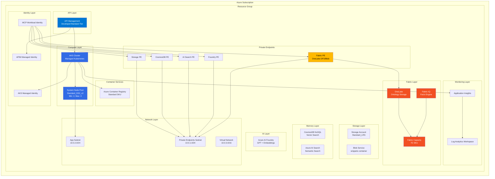

### Fabric Infrastructure Details

The Microsoft Fabric integration provides ontology-grounded facts for AI agents:

| Component | Purpose | Private Link DNS |
|-----------|---------|-----------------|
| Fabric Capacity | Compute for Fabric workloads | N/A (management plane) |
| OneLake DFS | Data File System API for ontologies | `privatelink.dfs.fabric.microsoft.com` |
| OneLake Blob | Blob API for file access | `privatelink.blob.fabric.microsoft.com` |
| Fabric API | REST API access | `privatelink.api.fabric.microsoft.com` |

### Fabric Data Agents

The Azure Agents Control Plane extends Fabric integration beyond Fabric IQ ontologies to include dedicated **Fabric Data Agents** that enable enterprise AI agents to interact directly with Microsoft Fabric's full data platform capabilities.

#### Agent Types

Four specialized Fabric Data Agents provide comprehensive data platform access:

| Agent Type | Purpose | MCP Tools | Query Language |
|------------|---------|-----------|----------------|
| **Lakehouse Agent** | Query/write to Fabric Lakehouses | `fabric_query_lakehouse` | Spark SQL |
| **Warehouse Agent** | Execute queries on Data Warehouses | `fabric_query_warehouse` | T-SQL |
| **Pipeline Agent** | Trigger and monitor data pipelines | `fabric_trigger_pipeline`, `fabric_get_pipeline_status` | N/A (REST API) |
| **Semantic Model Agent** | Query Power BI semantic models | `fabric_query_semantic_model` | DAX/MDX |

#### Architecture Overview

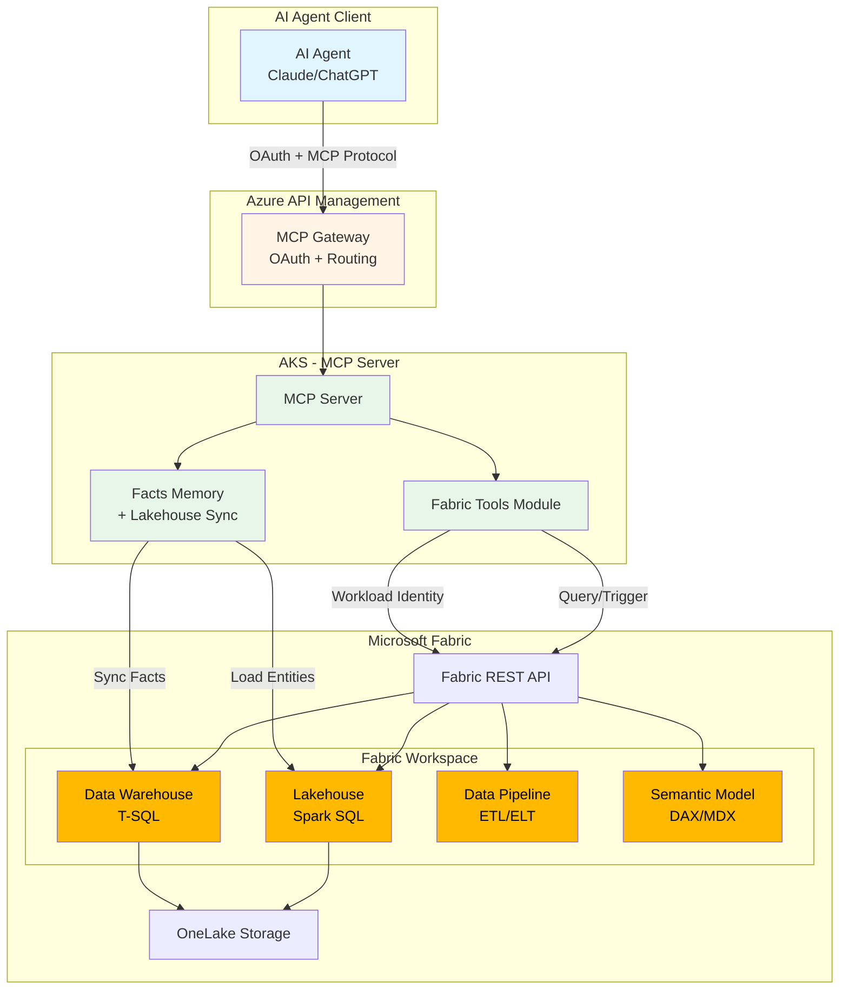

#### MCP Tools Reference

##### `fabric_query_lakehouse`

Execute Spark SQL queries against Fabric Lakehouses for big data analytics.

```json
{
  "tool": "fabric_query_lakehouse",
  "arguments": {
    "lakehouse_id": "abcd1234-5678-90ef-ghij-klmnopqrstuv",
    "query": "SELECT customer_id, churn_risk FROM customers WHERE churn_risk > 0.7",
    "lakehouse_name": "customer-analytics"
  }
}
```

**Use Cases:**
- Query large-scale customer data for churn analysis
- Extract pipeline telemetry for DevOps insights
- Analyze user behavior patterns across domains

##### `fabric_query_warehouse`

Execute T-SQL queries against Fabric Data Warehouses for structured analytics.

```json
{
  "tool": "fabric_query_warehouse",
  "arguments": {
    "warehouse_id": "wxyz9876-5432-10ab-cdef-ghijklmnopqr",
    "query": "SELECT TOP 10 * FROM sales_summary ORDER BY revenue DESC",
    "warehouse_name": "enterprise-dwh"
  }
}
```

**Use Cases:**
- Query aggregated sales data
- Retrieve deployment statistics
- Access role-based access control (RBAC) data

##### `fabric_trigger_pipeline`

Trigger Fabric Data Pipeline execution for ETL/ELT operations.

```json
{
  "tool": "fabric_trigger_pipeline",
  "arguments": {
    "pipeline_id": "pipe1234-5678-90ab-cdef-ghijklmnopqr",
    "pipeline_name": "customer-churn-etl",
    "parameters": "{\"run_date\": \"2026-02-07\", \"full_refresh\": false}"
  }
}
```

**Use Cases:**
- Refresh customer churn predictions
- Trigger CI/CD deployment pipeline analysis
- Schedule user access audits

##### `fabric_get_pipeline_status`

Monitor Fabric Data Pipeline execution status.

```json
{
  "tool": "fabric_get_pipeline_status",
  "arguments": {
    "pipeline_id": "pipe1234-5678-90ab-cdef-ghijklmnopqr",
    "run_id": "run5678-90ab-cdef-1234-567890abcdef",
    "pipeline_name": "customer-churn-etl"
  }
}
```

**Returns:** Pipeline status (NotStarted, InProgress, Succeeded, Failed, Cancelled)

##### `fabric_query_semantic_model`

Query Power BI semantic models using DAX or MDX for analytics.

```json
{
  "tool": "fabric_query_semantic_model",
  "arguments": {
    "dataset_id": "sem1234-5678-90ab-cdef-ghijklmnopqr",
    "query": "EVALUATE TOPN(10, Customer, [ChurnRisk], DESC)",
    "dataset_name": "customer-360",
    "query_language": "DAX"
  }
}
```

**Use Cases:**
- Query pre-built customer 360 models
- Access DevOps KPI dashboards
- Retrieve user access analytics

##### `fabric_list_resources`

Discover available Fabric resources in the workspace.

```json
{
  "tool": "fabric_list_resources",
  "arguments": {
    "resource_type": "all"
  }
}
```

**Resource Types:** `lakehouse`, `warehouse`, `pipeline`, `semantic_model`, `all`

#### Memory Integration

Fabric Data Agents extend the Facts Memory provider to pull entity data directly from Fabric:

**Load Entities from Lakehouse:**
```python
# Synchronize customer entities from Fabric Lakehouse
count = await facts_memory.load_entities_from_lakehouse(
    lakehouse_id="lakehouse-id",
    table_name="customers",
    entity_type=EntityType.CUSTOMER,
    id_column="customer_id"
)
```

**Sync Facts from Warehouse:**
```python
# Synchronize derived facts from Fabric Warehouse
count = await facts_memory.sync_facts_from_warehouse(
    warehouse_id="warehouse-id",
    fact_table="customer_insights",
    domain="customer"
)
```

This enables:
- Real-time entity data from Fabric lakehouses
- Cached frequently accessed data in short-term memory
- Indexed Fabric metadata in long-term memory for discovery

#### Security Model

**Workload Identity Authentication:**
- Uses Azure Entra ID workload identity federation
- No secrets or connection strings stored in code
- Authenticates with `DefaultAzureCredential` to Fabric REST API

**RBAC Roles (configured in `infra/app/fabric-data-agents.bicep`):**

| Role | Purpose | Permissions |
|------|---------|-------------|
| **Reader** | View workspace resources | Read-only access to lakehouses, warehouses, pipelines |
| **Contributor** | Manage data operations | Trigger pipelines, execute queries, write to lakehouses |
| **Storage Blob Data Contributor** | OneLake data access | Read/write data through OneLake DFS/Blob APIs |

**Audit Logging:**
- All Fabric operations logged to Azure Monitor
- Query execution tracked with timestamps and user context
- Pipeline triggers recorded with parameters and outcomes

#### Configuration

**Infrastructure (Bicep):**
```bicep
// Enable Fabric Data Agents
param fabricDataAgentsEnabled bool = true
param fabricWorkspaceId string = 'workspace-guid'

// Deployed in infra/app/fabric-data-agents.bicep
module fabricDataAgents 'app/fabric-data-agents.bicep' = {
  params: {
    agentPrincipalId: agentIdentity.principalId
    fabricCapacityId: fabricCapacity.id
    fabricWorkspaceId: fabricWorkspaceId
    fabricDataAgentsEnabled: fabricDataAgentsEnabled
  }
}
```

**Environment Variables (K8s):**
```yaml
- name: FABRIC_ENABLED
  value: "true"
- name: FABRIC_DATA_AGENTS_ENABLED
  value: "true"
- name: FABRIC_API_ENDPOINT
  value: "https://api.fabric.microsoft.com/v1"
- name: FABRIC_WORKSPACE_ID
  value: "abcd1234-workspace-guid"
```

#### Data Flow Example

**Agent Request Flow:**
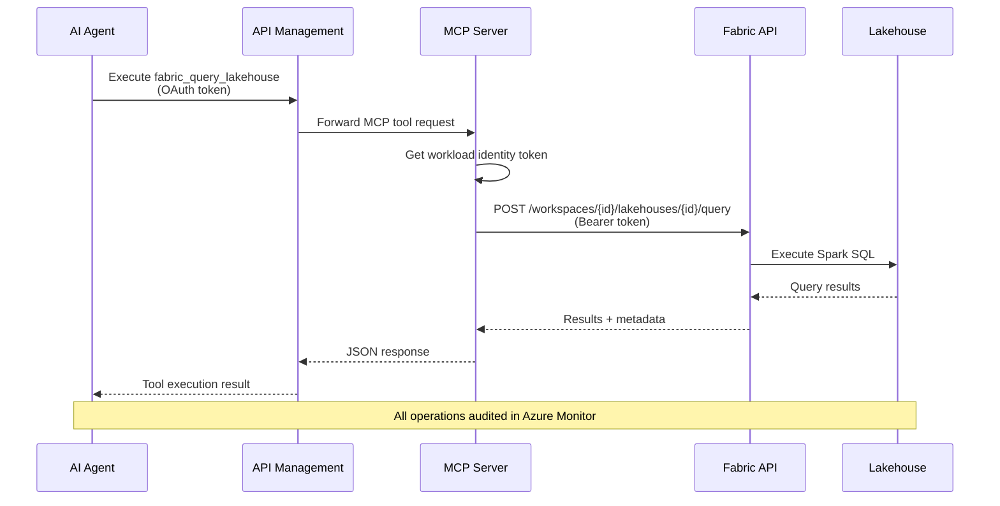

#### Integration with Existing Components

**Facts Memory (Fabric IQ):**
- Fabric IQ provides ontology-grounded facts for reasoning
- Fabric Data Agents enable real-time data queries
- Both use same workload identity and private endpoints

**Composite Memory Architecture:**
```
┌────────────────────────────────────────────────────────────┐
│                    Composite Memory                        │
├────────────────────────────────────────────────────────────┤
│                                                            │
│  ┌──────────────┐  ┌──────────────┐  ┌─────────────────┐ │
│  │ Short-Term   │  │ Long-Term    │  │  Facts Memory   │ │
│  │  (CosmosDB)  │  │ (AI Search)  │  │  (Fabric IQ)    │ │
│  │              │  │              │  │                 │ │
│  │ - Episodes   │  │ - Task Inst. │  │ - Ontologies    │ │
│  │ - Recent     │  │ - Best       │  │ - Domain Facts  │ │
│  │   Tasks      │  │   Practices  │  │ - Entities      │ │
│  └──────────────┘  └──────────────┘  └─────────────────┘ │
│                                             ↕              │
│                                      ┌─────────────────┐  │
│                                      │ Fabric Data     │  │
│                                      │ Agents          │  │
│                                      │                 │  │
│                                      │ - Lakehouses    │  │
│                                      │ - Warehouses    │  │
│                                      │ - Pipelines     │  │
│                                      │ - Semantic      │  │
│                                      │   Models        │  │
│                                      └─────────────────┘  │
└────────────────────────────────────────────────────────────┘
```

### Private Endpoint Architecture

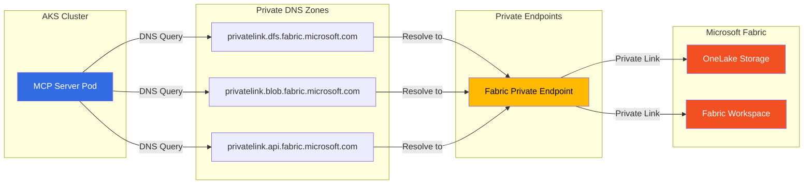

---

## Sequence Diagrams

### Agent Authentication Flow

OAuth 2.0 PKCE flow for AI agent authentication:

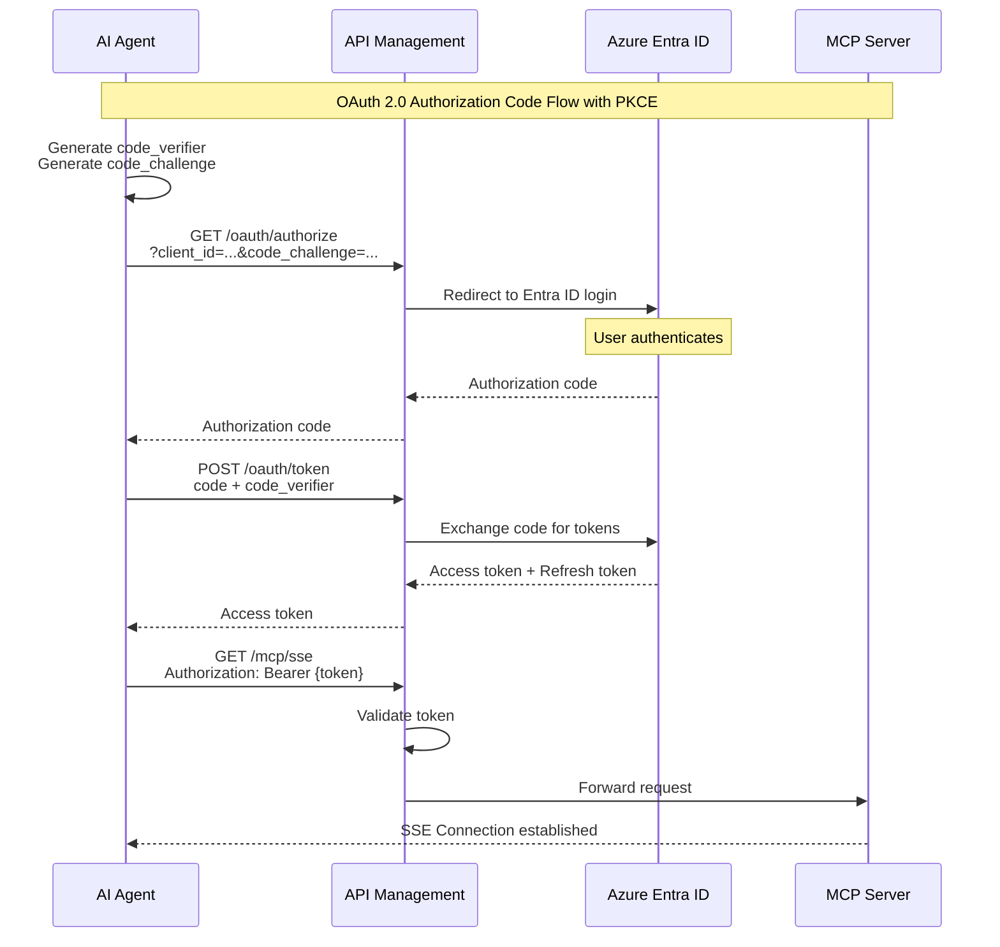

### MCP Tool Discovery

How AI agents discover available tools:

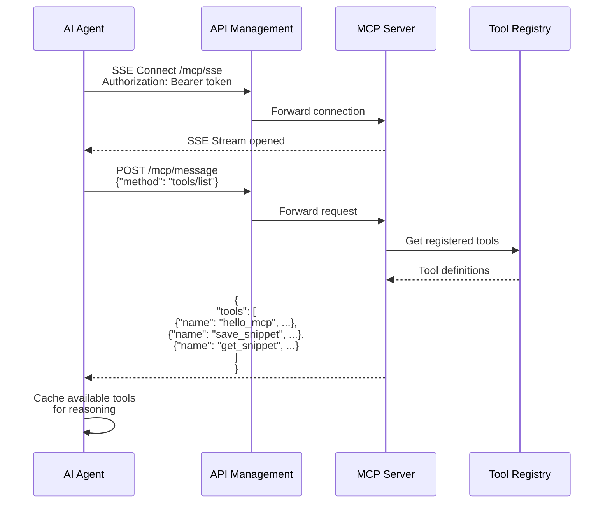

### MCP Tool Execution

Executing a tool and handling the response:

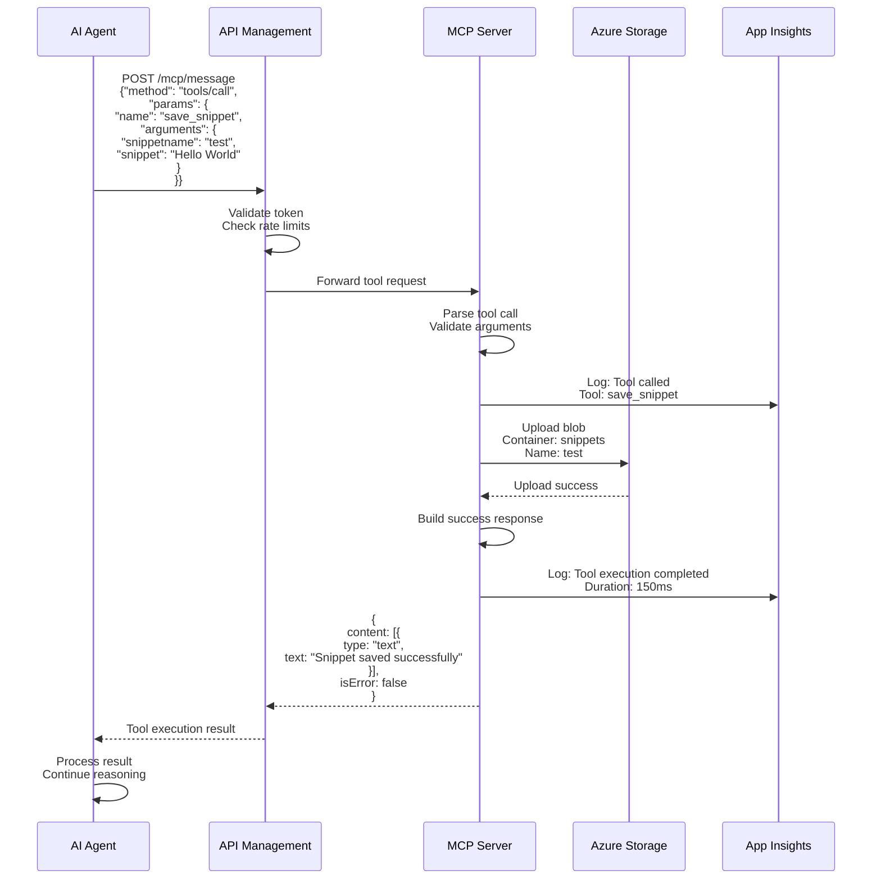

---

## Activity Diagrams

### Deployment Process Activity Diagram

Complete deployment workflow:

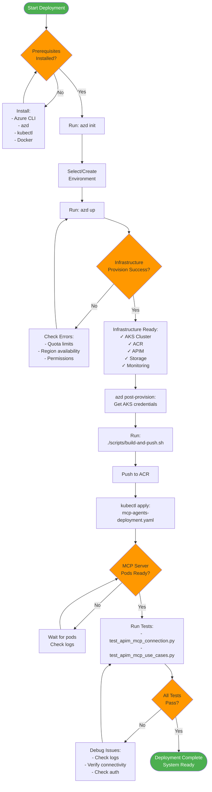

### Request Processing Activity Diagram

How a request flows through the system:

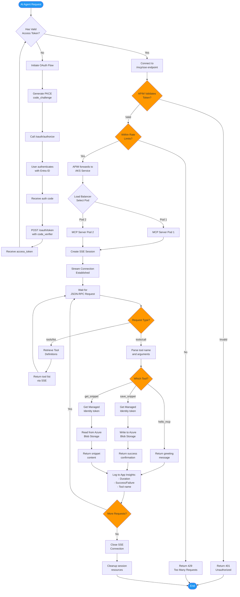

---

## Legend

### Component Diagram Shapes

- **Rectangle**: Component or Service
- **Cylinder**: Database or Storage
- **Hexagon**: External Service
- **Diamond**: Decision Point
- **Rounded Rectangle**: Process or Function

### Sequence Diagram Notation

- **Solid Line →**: Synchronous Call
- **Dashed Line ⇢**: Response
- **Note**: Additional Information
- **Alt/Else**: Alternative Paths

### Activity Diagram Symbols

- **Rounded Rectangle**: Activity/Process
- **Diamond**: Decision Point
- **Circle**: Start/End Point
- **Rectangle**: Subprocess

---

## Viewing These Diagrams

These Mermaid diagrams can be rendered in:

1. **GitHub/GitLab**: Automatically renders in markdown files
2. **VS Code**: Install "Markdown Preview Mermaid Support" extension
3. **Mermaid Live Editor**: https://mermaid.live
4. **Documentation Sites**: Most support Mermaid natively

---

## Additional Resources

- [Mermaid Documentation](https://mermaid.js.org/)
- [Deployment Guide](./README.md)
- [Azure Kubernetes Service](https://learn.microsoft.com/azure/aks/)
- [Model Context Protocol](https://modelcontextprotocol.io/)

