# Lab Manual: Build Your Own Agent with Azure Agents Control Plane, GitHub Copilot and SpecKit

## Overview

This lab guides you through creating a new AI agent using Azure as the secured, managed and governed control plane and GitHub Copilot - SpecKit to realize your new agent. Using the **SpecKit methodology** for specification-driven development, you will review the project constitution to understand governance principles, then write your agent specification and deploy to Azure Kubernetes Service (AKS) as a new pod.

**Duration**: 5 hours  
**Prerequisites**: Completed environment setup and deployed the base Azure Agents Control Plane infrastructure

---

## Exercises

| Exercise | Duration | Description |
|----------|----------|-------------|
| [Exercise 1: Lab Review](exercises/exercise_01_lab_review.md) | 30 min | Review objectives, architecture, validate environment |
| [Exercise 2: Build Agents](exercises/exercise_02_build_agents.md) | 2 hr | Use GitHub Copilot and SpecKit to specify, create, test, and deploy agents |
| [Exercise 3: Review End-to-End](exercises/exercise_03_review_end_to_end.md) | 30 min | Inspect governance, memory, observability, and identify problems |
| [Exercise 4: Fine-Tune Agent](exercises/exercise_04_fine_tune_agent.md) | 1 hr | Use Agent Lightning to fine-tune and correct agent behavior |
| [Exercise 5: Evaluations](exercises/exercise_05_evaluations.md) | 1 hr | Use evaluation framework to measure task adherence |

---

## Introduction

### What is the Azure Agents Control Plane?

The Azure Agents Control Plane is a comprehensive solution accelerator that governs the complete software development lifecycle of enterprise AI agents:

- **Analysis** - Understanding business problems and requirements
- **Design** - Creating agent specifications and architecture
- **Development** - Building agents with Copilot and SpecKit methodology
- **Testing** - Validating agent behavior and compliance
- **Deployment** - Releasing agents to governed runtimes
- **Observation** - Monitoring agent behavior and performance
- **Fine-Tuning** - Optimizing agent responses through reinforcement learning
- **Evaluation** - Measuring agent quality and task adherence

### Why Azure as the Enterprise Control Plane?

Traditional AI agent demos focus on getting something working quickly. However, enterprise deployments require:

- **Centralized Governance** - Policy enforcement, rate limiting, and compliance tracking
- **Identity-First Security** - Every agent has a Microsoft Entra ID identity with RBAC
- **API-First Architecture** - All agent operations flow through Azure API Management
- **Multi-Cloud Capable** - Agents can execute anywhere while being governed by Azure
- **Continuous Improvement** - Built-in evaluation and fine-tuning pipelines
- **Human Oversight** - Agent 365 integration for human-in-the-loop workflows

---

## Table of Contents

1. [Exercises](#exercises)
2. [Lab Objectives](#lab-objectives)
3. [Exercise 1: Lab Review](exercises/exercise_01_lab_review.md)
4. [Exercise 2: Build Agents](exercises/exercise_02_build_agents.md)
5. [Exercise 3: Review End-to-End](exercises/exercise_03_review_end_to_end.md)
6. [Exercise 4: Fine-Tune Agent](exercises/exercise_04_fine_tune_agent.md)
7. [Exercise 5: Evaluations](exercises/exercise_05_evaluations.md)
8. [Optional Exercises](#optional-exercises)
9. [References](#references)

---

## Lab Objectives

By the end of this lab, you will be able to:

### Building Your Agent
- ✅ Review the SpecKit constitution and understand governance principles for your agent
- ✅ Write a structured agent specification following the SpecKit methodology
- ✅ Implement an MCP-compliant agent using FastAPI
- ✅ Containerize your agent with Docker
- ✅ Deploy your agent to AKS as a new pod
- ✅ Integrate with the Azure Agents Control Plane infrastructure

### Enterprise Governance
- ✅ Understand how Azure API Management acts as the governance gateway
- ✅ Inspect APIM policies that enforce rate limits, quotas, and compliance
- ✅ Trace requests through the control plane using distributed tracing

### Security & Identity
- ✅ Configure workload identity federation for AKS pods
- ✅ Implement least-privilege RBAC for agent tool access
- ✅ Validate keyless authentication patterns

### Observability
- ✅ Monitor agent behavior using Azure Monitor and Application Insights
- ✅ Query telemetry with Kusto Query Language (KQL)

### Fine-Tuning & Evaluation
- ✅ Capture agent episodes for training data collection
- ✅ Label episodes with rewards (human or automated)
- ✅ Fine-tune models using Agent Lightning
- ✅ Run structured evaluations measuring intent resolution, tool accuracy, and task adherence

---

## Getting Started

To begin the lab, proceed to **Exercise 1: Lab Review** which will verify your environment and introduce the solution architecture.

**[Start Exercise 1: Lab Review →](exercises/exercise_01_lab_review.md)**

---

## Exercise Summaries

### Exercise 1: Lab Review (30 minutes)

Review objectives, architecture, and validate your environment is ready.

**Key Activities:**
- Review lab objectives and solution architecture
- Understand the Azure Agents Control Plane lifecycle
- Review all exercises
- Run `test_mcp_connection.py` to confirm environment works

**[Full Exercise →](exercises/exercise_01_lab_review.md)**

---

### Exercise 2: Build Agents (2 hours)

Use GitHub Copilot and SpecKit to specify, create, unit test, and deploy agents.

**Key Activities:**
- Review the project constitution
- Build an **Autonomous Agent** that operates without human intervention
- Build a **Human-in-the-Loop Agent** with Agent 365 approval workflow
- Use Copilot for specification, implementation, and testing
- Deploy both agents to AKS

**[Full Exercise →](exercises/exercise_02_build_agents.md)**

---

### Exercise 3: Review End-to-End (30 minutes)

Inspect governance, memory, observability, and identify problems.

**Key Activities:**
- Check APIM policies (rate limiting, OAuth, quotas)
- Check Cosmos DB for sessions and episodes
- Check AI Foundry/AI Search for long-term memory
- Check Fabric IQ/Storage for ontologies
- Check Log Analytics and App Insights for observability
- Check Entra ID/RBAC for identity
- Check Agent 365 for approval history
- Identify any problems with your agents

**[Full Exercise →](exercises/exercise_03_review_end_to_end.md)**

---

### Exercise 4: Fine-Tune Agent (1 hour)

Use Agent Lightning to fine-tune and correct agent behavior.

**Key Activities:**
- Enable episode capture
- Generate and review captured episodes
- Label episodes with rewards (manual or automated)
- Build fine-tuning dataset
- Submit fine-tuning job to Azure OpenAI
- Deploy tuned model
- Retest and validate improvement

**[Full Exercise →](exercises/exercise_04_fine_tune_agent.md)**

---

### Exercise 5: Evaluations (1 hour)

Use the evaluation framework to measure task adherence and agent quality.

**Key Activities:**
- Prepare evaluation dataset with test cases
- Run intent resolution evaluation
- Run tool call accuracy evaluation
- Run task adherence evaluation
- Generate evaluation report
- Compare scores over time

**[Full Exercise →](exercises/exercise_05_evaluations.md)**

---

## Troubleshooting

| Issue | Solution |
|-------|----------|
| Pod not starting | Check logs: `kubectl logs -n mcp-agents -l app=my-agent` |
| Image pull errors | Verify ACR login: `az acr login --name <registry>` |
| Health check failing | Ensure `/health` endpoint returns 200 |
| Workload identity issues | Verify service account annotations |
| AKS connection failed | Run: `az aks get-credentials --resource-group <rg> --name <cluster>` |
| Missing namespace | Deploy base infrastructure: `azd provision` |

---

## Optional Exercises

For advanced topics, explore the optional exercises:

| Exercise | Duration | Description |
|----------|----------|-------------|
| [External Agents MCP Integration](exercises-optional/exercise_external_agents_mcp_integration.md) | 2-3 hr | Integrate OpenAI Assistants, AWS Bedrock, Google Vertex AI with Azure governance |
| [Fabric Data Agents](exercises-optional/exercise_fabric_data_agents.md) | 2-3 hr | Build agents that query Fabric Lakehouses, Warehouses, and Semantic Models |
| [Agent Red Teaming](exercises-optional/exercise_agents_redteaming.md) | 2-3 hr | Red team your agents using Microsoft's PyRIT framework |
| [SRE Agent](exercises-optional/exercise_sre_agent.md) | 3-4 hr | Build an SRE agent for automated monitoring, diagnosis, and remediation |

---

## References

- [Azure API Management Documentation](https://docs.microsoft.com/azure/api-management/)
- [Azure Kubernetes Service Documentation](https://docs.microsoft.com/azure/aks/)
- [MCP Protocol Specification](https://modelcontextprotocol.io/)
- [Azure AI Foundry Documentation](https://docs.microsoft.com/azure/ai-services/)
- [Azure Cosmos DB Documentation](https://docs.microsoft.com/azure/cosmos-db/)

---

## Congratulations!

You've completed the **Build Your Own Agent** lab! Through 5 exercises, you've learned to:

1. ✅ **Reviewed** the lab objectives, solution architecture, and exercise structure
2. ✅ **Built** both autonomous and human-in-the-loop agents using GitHub Copilot with SpecKit
3. ✅ **Reviewed** governance, memory, observability, and security end-to-end
4. ✅ **Fine-tuned** your agent using Agent Lightning with reinforcement learning
5. ✅ **Evaluated** your agent using the Azure AI Evaluation SDK

Your agents now benefit from:
- **Enterprise governance** through APIM policies
- **Persistent memory** with Cosmos DB
- **Intelligent search** via AI Foundry and AI Search integration
- **Human oversight** through Agent 365 approvals
- **Continuous improvement** via Agent Lightning fine-tuning
- **Quality assurance** through comprehensive evaluations
- **Full observability** with Azure Monitor integration

**Next Steps:**
- Explore the Optional Exercises above for advanced topics
- Review `docs/AGENTS_ARCHITECTURE.md` for deeper architectural understanding
- Check `docs/AGENTS_EVALUATIONS.md` for advanced evaluation techniques
- See `docs/AGENTS_IDENTITY_DESIGN.md` for security deep-dive

---

**End of Lab Manual**

Create your agent implementation in `src/agents/my_agent/agent.py`:
