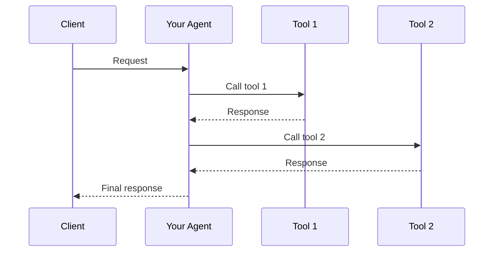

# Lab Manual: Build Your Own Agent with SpecKit

## Overview

This lab guides you through creating a new AI agent using the **SpecKit methodology** for specification-driven development. You will write a constitution and agent specification, then implement and deploy your agent to Azure Kubernetes Service (AKS) as a new pod.

**Duration**: 2-3 hours  
**Prerequisites**: Completed environment setup and deployed the base Azure Agents Control Plane infrastructure

---

## Table of Contents

1. [Lab Objectives](#lab-objectives)
2. [Prerequisites Check](#prerequisites-check)
3. [Part 1: Understanding SpecKit Methodology](#part-1-understanding-speckit-methodology)
4. [Part 2: Writing Your Agent Constitution](#part-2-writing-your-agent-constitution)
5. [Part 3: Creating Your Agent Specification](#part-3-creating-your-agent-specification)
6. [Part 4: Implementing Your Agent](#part-4-implementing-your-agent)
7. [Part 5: Containerizing Your Agent](#part-5-containerizing-your-agent)
8. [Part 6: Deploying to AKS](#part-6-deploying-to-aks)
9. [Part 7: Verification and Testing](#part-7-verification-and-testing)
10. [Part 8: Next Steps](#part-8-next-steps)

---

## Lab Objectives

By the end of this lab, you will be able to:

- ✅ Create a SpecKit constitution that defines governance principles for your agent
- ✅ Write a structured agent specification following the SpecKit methodology
- ✅ Implement an MCP-compliant agent using FastAPI
- ✅ Containerize your agent with Docker
- ✅ Deploy your agent to AKS as a new pod
- ✅ Integrate with the Azure Agents Control Plane infrastructure

---

## Prerequisites Check

Before starting this lab, verify you have:

### Development Environment

```powershell
# Check Python version (3.11+ required)
python --version

# Check Docker
docker --version

# Check Azure CLI
az --version

# Check kubectl
kubectl version --client

# Check you're logged in to Azure
az account show
```

### AKS Cluster Access

```powershell
# Verify AKS connection
kubectl get nodes

# Verify mcp-agents namespace exists
kubectl get namespace mcp-agents
```

### Environment Variables

Ensure these are set in your terminal session:

```powershell
# Required environment variables
$env:CONTAINER_REGISTRY      # e.g., "youracr.azurecr.io"
$env:AZURE_TENANT_ID         # Your Azure tenant ID
$env:FOUNDRY_PROJECT_ENDPOINT # Azure AI Foundry endpoint
$env:COSMOSDB_ENDPOINT        # CosmosDB endpoint
```

---

## Part 1: Understanding SpecKit Methodology

### What is SpecKit?

SpecKit is a **specification-driven development methodology** that ensures all agents are properly defined before implementation. It follows the principle: **"Specifications drive code, not vice versa."**

### SpecKit Structure

```
.speckit/
├── constitution.md           # Core principles and governance framework
└── specifications/           # Individual agent specifications
    ├── your_agent.spec.md    # Your agent specification (you'll create this)
    └── ...
```

### Key Principles

| Principle | Description |
|-----------|-------------|
| **Analysis First** | Document business problem before coding |
| **Design Explicitly** | Create architecture diagrams and tool catalogs |
| **Test-First Approach** | Define acceptance criteria that are testable |
| **Schema Evolution** | Specifications drive code changes |

### Review Existing Examples

Take 5 minutes to review the existing constitution and specifications:

```powershell
# View the constitution
code .speckit/constitution.md

# View example specifications
code .speckit/specifications/customer_churn_agent.spec.md
code .speckit/specifications/devops_cicd_pipeline_agent.spec.md
```

---

## Part 2: Writing Your Agent Constitution

> **Note**: If you're building an agent for an existing project that already has a constitution, you can skip this section and use the existing constitution. Otherwise, follow these steps to create your own.

### Step 2.1: Create Your Constitution File

Create a new constitution file for your agent project:

```powershell
# Create the speckit directory if it doesn't exist
New-Item -ItemType Directory -Path ".speckit" -Force

# Create your constitution file
code .speckit/constitution.md
```

### Step 2.2: Constitution Template

Copy and customize this template for your constitution:

```markdown
# [Your Project Name] Constitution

## Project Overview

[Describe your project's mission and the role of AI agents within it. What problem are you solving? Who are the users?]

**Mission**: [One sentence describing the ultimate goal]

## Core Principles

### 1. [Principle Name]
- [Specific guideline]
- [Specific guideline]
- [Specific guideline]

### 2. [Principle Name]
- [Specific guideline]
- [Specific guideline]

### 3. Security Requirements
- **Authentication**: [How agents authenticate]
- **Authorization**: [How permissions are managed]
- **Data Protection**: [How sensitive data is handled]

### 4. Quality Standards
- **Code Quality**: [Coding standards and requirements]
- **Testing**: [Testing requirements]
- **Documentation**: [Documentation standards]

## Development Phases

### Analysis Phase
- [ ] Document business problem and outcomes
- [ ] Identify agent decomposition opportunities
- [ ] Define success KPIs

### Design Phase
- [ ] Create architecture diagrams
- [ ] Define MCP tool catalog
- [ ] Specify memory architecture

### Implementation Phase
- [ ] Follow coding standards
- [ ] Implement MCP endpoints
- [ ] Add observability

### Testing Phase
- [ ] Unit tests (>80% coverage)
- [ ] Integration tests
- [ ] Security tests

### Deployment Phase
- [ ] Containerize with Docker
- [ ] Deploy to AKS
- [ ] Configure monitoring

## Governance

### Change Management
- [How changes are managed]

### Review Process
- [Code review requirements]
- [Security review requirements]

## Success Criteria

- [ ] [Measurable criterion 1]
- [ ] [Measurable criterion 2]
- [ ] [Measurable criterion 3]
```

### Step 2.3: Save Your Constitution

After customizing the template, save the file. This constitution will guide all agent development in your project.

---

## Part 3: Creating Your Agent Specification

### Step 3.1: Create Your Specification File

```powershell
# Create specifications directory
New-Item -ItemType Directory -Path ".speckit/specifications" -Force

# Create your agent specification (replace 'my_agent' with your agent name)
code .speckit/specifications/my_agent.spec.md
```

### Step 3.2: Agent Specification Template

Use this comprehensive template for your agent specification:

```markdown
# [Your Agent Name] Agent Specification

## Overview

| Property | Value |
|----------|-------|
| **Spec ID** | `[UNIQUE-ID]-001` |
| **Version** | `1.0.0` |
| **Status** | `Draft` |
| **Domain** | [e.g., Customer Analytics, DevOps, Healthcare] |
| **Agent Type** | [Single Agent / Multi-Agent Orchestrated] |
| **Governance Model** | [Autonomous / Semi-Autonomous / Not Autonomous] |

## Business Framing

[2-3 paragraphs describing the business context and why this agent is needed]

### Value Proposition

[Explain the value this agent provides to users and the organization]

## Target Problems Addressed

| Problem | Impact | Agent Solution |
|---------|--------|----------------|
| [Problem 1] | [Impact description] | [How agent solves it] |
| [Problem 2] | [Impact description] | [How agent solves it] |
| [Problem 3] | [Impact description] | [How agent solves it] |

## Agent Architecture

### Architecture Diagram

```
┌─────────────────────────────────────────────────────────────────────┐
│                         Your Agent                                   │
│              [Describe the agent's primary function]                 │
└────────────────────┬────────────────────────────────────────────────┘
                     │
    ┌────────────────┼────────────────┬────────────────┐
    ▼                ▼                ▼                ▼
┌─────────┐   ┌───────────┐   ┌───────────┐   ┌───────────┐
│ Tool 1  │   │  Tool 2   │   │  Tool 3   │   │  Tool 4   │
└─────────┘   └───────────┘   └───────────┘   └───────────┘
```

### Control Plane Integration

| Component | Azure Service | Integration Pattern |
|-----------|---------------|---------------------|
| API Gateway | Azure API Management | MCP façade |
| Agent Runtime | Azure Kubernetes Service | Workload identity |
| Storage | [CosmosDB/Blob/etc.] | [Pattern] |
| AI Models | Azure AI Foundry | [Pattern] |
| Identity | Microsoft Entra ID | Agent Identity |
| Observability | Azure Monitor + App Insights | OpenTelemetry |

## MCP Tool Catalog

| Tool Name | Description | Input Schema | Output Schema |
|-----------|-------------|--------------|---------------|
| `tool_name_1` | [Description] | `{ param1: type }` | `{ result: type }` |
| `tool_name_2` | [Description] | `{ param1: type }` | `{ result: type }` |
| `tool_name_3` | [Description] | `{ param1: type }` | `{ result: type }` |

## Workflow Specification

### Primary Flow: [Flow Name]



### Alternative Flows

1. **[Flow Name]**: [Description]
2. **[Flow Name]**: [Description]

## Memory Specification

### Memory Types Used

| Memory Type | Provider | Purpose |
|-------------|----------|---------|
| Short-term | CosmosDB | Session context |
| Long-term | AI Search | Historical data |
| Facts | Fabric IQ | Domain knowledge |

## Success Metrics (KPIs)

### Technical Metrics

| Metric | Target | Measurement |
|--------|--------|-------------|
| API Latency P95 | < 500ms | App Insights |
| Availability | > 99.5% | Azure Monitor |
| Error Rate | < 1% | App Insights |

### Business Metrics

| Metric | Target | Measurement |
|--------|--------|-------------|
| [Business KPI 1] | [Target] | [How measured] |
| [Business KPI 2] | [Target] | [How measured] |

## Evaluation Criteria

| Criterion | Weight | Evaluator |
|-----------|--------|-----------|
| Task Adherence | 40% | TaskAdherenceEvaluator |
| Tool Call Accuracy | 30% | ToolCallAccuracyEvaluator |
| Intent Resolution | 30% | IntentResolutionEvaluator |

## Security Requirements

- [ ] Authenticate via Entra ID workload identity
- [ ] All data encrypted in transit (TLS 1.2+)
- [ ] No secrets in code or logs
- [ ] Audit logging for all operations

## Dependencies

| Dependency | Version | Purpose |
|------------|---------|---------|
| FastAPI | >=0.115.0 | MCP server framework |
| azure-identity | >=1.19.0 | Azure authentication |
| [Other dependencies] | [Version] | [Purpose] |

## Version History

| Version | Date | Author | Changes |
|---------|------|--------|---------|
| 1.0.0 | [Date] | [Your Name] | Initial specification |
```

### Step 3.3: Complete Your Specification

Fill in all sections of the template with details specific to your agent. Key areas to focus on:

1. **MCP Tool Catalog**: Define all tools your agent will expose
2. **Workflow Specification**: Create sequence diagrams for primary flows
3. **Memory Specification**: Decide what data your agent needs to persist
4. **Success Metrics**: Define measurable criteria for success

---

## Part 4: Implementing Your Agent

### Step 4.1: Create Agent Directory Structure

```powershell
# Create your agent's source directory
New-Item -ItemType Directory -Path "src/agents/my_agent" -Force

# Create required files
New-Item -ItemType File -Path "src/agents/my_agent/__init__.py"
New-Item -ItemType File -Path "src/agents/my_agent/agent.py"
New-Item -ItemType File -Path "src/agents/my_agent/tools.py"
New-Item -ItemType File -Path "src/agents/my_agent/requirements.txt"
New-Item -ItemType File -Path "src/agents/my_agent/Dockerfile"
```

### Step 4.2: Implement Your Agent

Create your agent implementation in `src/agents/my_agent/agent.py`:

```python
"""
[Your Agent Name] Agent
FastAPI MCP Server Implementation
"""

import json
import logging
import asyncio
import uuid
from typing import Dict, Any, Optional, List
from datetime import datetime

from fastapi import FastAPI, Request
from fastapi.responses import StreamingResponse, JSONResponse
from azure.identity import DefaultAzureCredential
from pydantic import BaseModel
import os

# Configure logging
logging.basicConfig(level=logging.INFO)
logger = logging.getLogger(__name__)

# Initialize FastAPI app
app = FastAPI(
    title="[Your Agent Name] Agent",
    description="[Description from your specification]",
    version="1.0.0"
)

# =============================================================================
# MCP TOOL DEFINITIONS
# =============================================================================

# Define your tools based on your specification
MCP_TOOLS = [
    {
        "name": "tool_name_1",
        "description": "Description from your MCP Tool Catalog",
        "inputSchema": {
            "type": "object",
            "properties": {
                "param1": {
                    "type": "string",
                    "description": "Parameter description"
                }
            },
            "required": ["param1"]
        }
    },
    {
        "name": "tool_name_2",
        "description": "Description from your MCP Tool Catalog",
        "inputSchema": {
            "type": "object",
            "properties": {
                "param1": {
                    "type": "string",
                    "description": "Parameter description"
                }
            },
            "required": ["param1"]
        }
    },
    # Add more tools based on your specification
]

# =============================================================================
# TOOL IMPLEMENTATIONS
# =============================================================================

async def execute_tool_1(param1: str) -> Dict[str, Any]:
    """
    Implement your first tool logic here.
    This should match the tool defined in your specification.
    """
    logger.info(f"Executing tool_name_1 with param1={param1}")
    
    # Your implementation here
    result = {
        "status": "success",
        "data": f"Processed {param1}",
        "timestamp": datetime.utcnow().isoformat()
    }
    
    return result


async def execute_tool_2(param1: str) -> Dict[str, Any]:
    """
    Implement your second tool logic here.
    """
    logger.info(f"Executing tool_name_2 with param1={param1}")
    
    # Your implementation here
    result = {
        "status": "success",
        "data": f"Processed {param1}",
        "timestamp": datetime.utcnow().isoformat()
    }
    
    return result


# Tool dispatcher
TOOL_HANDLERS = {
    "tool_name_1": execute_tool_1,
    "tool_name_2": execute_tool_2,
}

# =============================================================================
# MCP PROTOCOL ENDPOINTS
# =============================================================================

@app.get("/health")
async def health_check():
    """Health check endpoint for Kubernetes probes."""
    return {"status": "healthy", "agent": "[Your Agent Name]", "version": "1.0.0"}


@app.get("/sse")
async def sse_endpoint(request: Request):
    """
    Server-Sent Events endpoint for MCP protocol.
    Streams tool discovery and capabilities.
    """
    async def event_generator():
        # Send initialization event
        init_event = {
            "jsonrpc": "2.0",
            "method": "notifications/initialized",
            "params": {}
        }
        yield f"data: {json.dumps(init_event)}\n\n"
        
        # Keep connection alive
        while True:
            if await request.is_disconnected():
                break
            await asyncio.sleep(30)
            yield f": keepalive\n\n"
    
    return StreamingResponse(
        event_generator(),
        media_type="text/event-stream",
        headers={
            "Cache-Control": "no-cache",
            "Connection": "keep-alive",
            "X-Accel-Buffering": "no"
        }
    )


@app.post("/message")
async def message_endpoint(request: Request):
    """
    JSON-RPC 2.0 message endpoint for MCP protocol.
    Handles tool discovery and execution.
    """
    try:
        body = await request.json()
        method = body.get("method", "")
        params = body.get("params", {})
        request_id = body.get("id")
        
        logger.info(f"Received MCP message: method={method}")
        
        # Handle different MCP methods
        if method == "initialize":
            return JSONResponse({
                "jsonrpc": "2.0",
                "id": request_id,
                "result": {
                    "protocolVersion": "2024-11-05",
                    "capabilities": {
                        "tools": {"listChanged": True}
                    },
                    "serverInfo": {
                        "name": "[Your Agent Name] Agent",
                        "version": "1.0.0"
                    }
                }
            })
        
        elif method == "tools/list":
            return JSONResponse({
                "jsonrpc": "2.0",
                "id": request_id,
                "result": {
                    "tools": MCP_TOOLS
                }
            })
        
        elif method == "tools/call":
            tool_name = params.get("name")
            tool_args = params.get("arguments", {})
            
            if tool_name not in TOOL_HANDLERS:
                return JSONResponse({
                    "jsonrpc": "2.0",
                    "id": request_id,
                    "error": {
                        "code": -32601,
                        "message": f"Unknown tool: {tool_name}"
                    }
                })
            
            # Execute the tool
            handler = TOOL_HANDLERS[tool_name]
            result = await handler(**tool_args)
            
            return JSONResponse({
                "jsonrpc": "2.0",
                "id": request_id,
                "result": {
                    "content": [
                        {
                            "type": "text",
                            "text": json.dumps(result, indent=2)
                        }
                    ]
                }
            })
        
        else:
            return JSONResponse({
                "jsonrpc": "2.0",
                "id": request_id,
                "error": {
                    "code": -32601,
                    "message": f"Method not found: {method}"
                }
            })
    
    except Exception as e:
        logger.error(f"Error processing message: {e}")
        return JSONResponse({
            "jsonrpc": "2.0",
            "id": body.get("id") if 'body' in dir() else None,
            "error": {
                "code": -32603,
                "message": str(e)
            }
        })


# =============================================================================
# STARTUP
# =============================================================================

@app.on_event("startup")
async def startup_event():
    """Initialize agent on startup."""
    logger.info("=" * 60)
    logger.info("[Your Agent Name] Agent Starting...")
    logger.info("=" * 60)
    
    # Initialize Azure credentials
    try:
        credential = DefaultAzureCredential()
        logger.info("✅ Azure credentials initialized")
    except Exception as e:
        logger.warning(f"⚠️ Azure credentials not available: {e}")
    
    logger.info(f"✅ Registered {len(MCP_TOOLS)} MCP tools")
    logger.info("✅ Agent ready to accept connections")


if __name__ == "__main__":
    import uvicorn
    uvicorn.run(app, host="0.0.0.0", port=8000)
```

### Step 4.3: Create Requirements File

Create `src/agents/my_agent/requirements.txt`:

```
# FastAPI MCP Server Dependencies
fastapi>=0.115.0
uvicorn[standard]>=0.30.6
pydantic>=2.9.0

# Azure SDK
azure-identity>=1.19.0

# Add other dependencies from your specification
```

### Step 4.4: Test Locally

```powershell
# Navigate to your agent directory
cd src/agents/my_agent

# Create virtual environment
python -m venv .venv
.venv\Scripts\Activate.ps1

# Install dependencies
pip install -r requirements.txt

# Run locally
python agent.py
```

Test the endpoints:

```powershell
# Test health endpoint
Invoke-RestMethod -Uri "http://localhost:8000/health"

# Test MCP initialize
$body = @{
    jsonrpc = "2.0"
    id = 1
    method = "initialize"
    params = @{}
} | ConvertTo-Json

Invoke-RestMethod -Uri "http://localhost:8000/message" -Method Post -Body $body -ContentType "application/json"

# Test tools/list
$body = @{
    jsonrpc = "2.0"
    id = 2
    method = "tools/list"
    params = @{}
} | ConvertTo-Json

Invoke-RestMethod -Uri "http://localhost:8000/message" -Method Post -Body $body -ContentType "application/json"
```

---

## Part 5: Containerizing Your Agent

### Step 5.1: Create Dockerfile

Create `src/agents/my_agent/Dockerfile`:

```dockerfile
# Use Python 3.11 slim image
FROM python:3.11-slim

# Set working directory
WORKDIR /app

# Install system dependencies
RUN apt-get update && apt-get install -y \
    curl \
    && rm -rf /var/lib/apt/lists/*

# Copy requirements file
COPY requirements.txt .

# Install Python dependencies
RUN pip install --no-cache-dir -r requirements.txt

# Copy application code
COPY agent.py .
COPY tools.py .

# Create non-root user for security
RUN useradd -m -u 1000 agentuser && \
    chown -R agentuser:agentuser /app

# Switch to non-root user
USER agentuser

# Expose port
EXPOSE 8000

# Health check
HEALTHCHECK --interval=30s --timeout=3s --start-period=5s --retries=3 \
    CMD curl -f http://localhost:8000/health || exit 1

# Run the application
CMD ["uvicorn", "agent:app", "--host", "0.0.0.0", "--port", "8000"]
```

### Step 5.2: Build Docker Image

```powershell
# Navigate to your agent directory
cd src/agents/my_agent

# Build the image locally
docker build -t my-agent:latest .

# Test locally with Docker
docker run -p 8000:8000 my-agent:latest

# Test the container
Invoke-RestMethod -Uri "http://localhost:8000/health"
```

### Step 5.3: Push to Azure Container Registry

```powershell
# Set environment variables
$REGISTRY = $env:CONTAINER_REGISTRY  # e.g., "youracr.azurecr.io"
$IMAGE_NAME = "my-agent"
$IMAGE_TAG = "v1.0.0"

# Login to ACR
$registryName = $REGISTRY -replace '\..*', ''
az acr login --name $registryName

# Tag the image
docker tag my-agent:latest "$REGISTRY/${IMAGE_NAME}:${IMAGE_TAG}"
docker tag my-agent:latest "$REGISTRY/${IMAGE_NAME}:latest"

# Push to ACR
docker push "$REGISTRY/${IMAGE_NAME}:${IMAGE_TAG}"
docker push "$REGISTRY/${IMAGE_NAME}:latest"

# Verify the image is in ACR
az acr repository show-tags --name $registryName --repository $IMAGE_NAME
```

---

## Part 6: Deploying to AKS

### Step 6.1: Create Kubernetes Deployment Manifest

Create `k8s/my-agent-deployment.yaml`:

```yaml
apiVersion: v1
kind: Namespace
metadata:
  name: mcp-agents
  labels:
    azure.workload.identity/use: "true"
---
# ServiceAccount for workload identity
apiVersion: v1
kind: ServiceAccount
metadata:
  name: my-agent-sa
  namespace: mcp-agents
  annotations:
    azure.workload.identity/client-id: "${MCP_SERVER_IDENTITY_CLIENT_ID}"
  labels:
    azure.workload.identity/use: "true"
    app: my-agent
---
# Deployment
apiVersion: apps/v1
kind: Deployment
metadata:
  name: my-agent
  namespace: mcp-agents
  labels:
    app: my-agent
spec:
  replicas: 2
  selector:
    matchLabels:
      app: my-agent
  template:
    metadata:
      labels:
        app: my-agent
        azure.workload.identity/use: "true"
    spec:
      serviceAccountName: my-agent-sa
      containers:
      - name: my-agent
        image: ${CONTAINER_REGISTRY}/my-agent:latest
        imagePullPolicy: Always
        ports:
        - containerPort: 8000
          name: http
          protocol: TCP
        env:
        # Azure Configuration
        - name: AZURE_CLIENT_ID
          value: "${MCP_SERVER_IDENTITY_CLIENT_ID}"
        # Add more environment variables as needed from your specification
        resources:
          requests:
            memory: "256Mi"
            cpu: "250m"
          limits:
            memory: "512Mi"
            cpu: "500m"
        livenessProbe:
          httpGet:
            path: /health
            port: 8000
          initialDelaySeconds: 10
          periodSeconds: 30
          timeoutSeconds: 5
          failureThreshold: 3
        readinessProbe:
          httpGet:
            path: /health
            port: 8000
          initialDelaySeconds: 5
          periodSeconds: 10
          timeoutSeconds: 3
          failureThreshold: 3
        securityContext:
          runAsNonRoot: true
          runAsUser: 1000
          allowPrivilegeEscalation: false
          readOnlyRootFilesystem: true
          capabilities:
            drop:
            - ALL
      volumes:
      - name: tmp-volume
        emptyDir: {}
---
# Service (ClusterIP for internal access)
apiVersion: v1
kind: Service
metadata:
  name: my-agent
  namespace: mcp-agents
  labels:
    app: my-agent
spec:
  type: ClusterIP
  ports:
  - port: 80
    targetPort: 8000
    protocol: TCP
    name: http
  selector:
    app: my-agent
---
# Optional: LoadBalancer for external access
apiVersion: v1
kind: Service
metadata:
  name: my-agent-external
  namespace: mcp-agents
  labels:
    app: my-agent
spec:
  type: LoadBalancer
  ports:
  - port: 80
    targetPort: 8000
    protocol: TCP
    name: http
  selector:
    app: my-agent
```

### Step 6.2: Configure the Manifest

Replace the placeholder variables with actual values:

```powershell
# Get values from your environment
$CONTAINER_REGISTRY = $env:CONTAINER_REGISTRY
$MCP_SERVER_IDENTITY_CLIENT_ID = $env:MCP_SERVER_IDENTITY_CLIENT_ID

# Create configured manifest
$manifestContent = Get-Content -Path "k8s/my-agent-deployment.yaml" -Raw
$manifestContent = $manifestContent -replace '\$\{CONTAINER_REGISTRY\}', $CONTAINER_REGISTRY
$manifestContent = $manifestContent -replace '\$\{MCP_SERVER_IDENTITY_CLIENT_ID\}', $MCP_SERVER_IDENTITY_CLIENT_ID

# Save configured manifest
$manifestContent | Out-File -FilePath "k8s/my-agent-deployment-configured.yaml" -Encoding UTF8
```

### Step 6.3: Deploy to AKS

```powershell
# Apply the deployment
kubectl apply -f k8s/my-agent-deployment-configured.yaml

# Watch the pods come up
kubectl get pods -n mcp-agents -l app=my-agent -w

# Check deployment status
kubectl rollout status deployment/my-agent -n mcp-agents
```

### Step 6.4: Verify Deployment

```powershell
# Check pods are running
kubectl get pods -n mcp-agents -l app=my-agent

# Check services
kubectl get svc -n mcp-agents

# View pod logs
kubectl logs -n mcp-agents -l app=my-agent --tail=50

# Describe deployment for details
kubectl describe deployment my-agent -n mcp-agents
```

---

## Part 7: Verification and Testing

### Step 7.1: Test via Port Forward

```powershell
# Port forward to test locally
kubectl port-forward -n mcp-agents svc/my-agent 8080:80

# In a new terminal, test the endpoints
Invoke-RestMethod -Uri "http://localhost:8080/health"
```

### Step 7.2: Test MCP Protocol

```powershell
# Test MCP initialize
$initBody = @{
    jsonrpc = "2.0"
    id = 1
    method = "initialize"
    params = @{}
} | ConvertTo-Json

$response = Invoke-RestMethod -Uri "http://localhost:8080/message" -Method Post -Body $initBody -ContentType "application/json"
$response | ConvertTo-Json -Depth 10

# Test tools/list
$listBody = @{
    jsonrpc = "2.0"
    id = 2
    method = "tools/list"
    params = @{}
} | ConvertTo-Json

$response = Invoke-RestMethod -Uri "http://localhost:8080/message" -Method Post -Body $listBody -ContentType "application/json"
$response | ConvertTo-Json -Depth 10

# Test a tool call
$callBody = @{
    jsonrpc = "2.0"
    id = 3
    method = "tools/call"
    params = @{
        name = "tool_name_1"
        arguments = @{
            param1 = "test_value"
        }
    }
} | ConvertTo-Json -Depth 5

$response = Invoke-RestMethod -Uri "http://localhost:8080/message" -Method Post -Body $callBody -ContentType "application/json"
$response | ConvertTo-Json -Depth 10
```

### Step 7.3: Test via LoadBalancer (if enabled)

```powershell
# Get the external IP
$externalIP = kubectl get svc my-agent-external -n mcp-agents -o jsonpath='{.status.loadBalancer.ingress[0].ip}'

# Test health endpoint
Invoke-RestMethod -Uri "http://${externalIP}/health"
```

### Step 7.4: Create Integration Test

Create `tests/test_my_agent.py`:

```python
"""
Integration tests for My Agent
"""

import pytest
import requests
import json

# Configure test endpoint
BASE_URL = "http://localhost:8080"  # Use port-forward or LoadBalancer IP


class TestMyAgent:
    """Test suite for My Agent MCP endpoints."""
    
    def test_health_endpoint(self):
        """Test health check endpoint."""
        response = requests.get(f"{BASE_URL}/health")
        assert response.status_code == 200
        data = response.json()
        assert data["status"] == "healthy"
    
    def test_mcp_initialize(self):
        """Test MCP initialize method."""
        payload = {
            "jsonrpc": "2.0",
            "id": 1,
            "method": "initialize",
            "params": {}
        }
        response = requests.post(f"{BASE_URL}/message", json=payload)
        assert response.status_code == 200
        data = response.json()
        assert "result" in data
        assert data["result"]["protocolVersion"] == "2024-11-05"
    
    def test_mcp_tools_list(self):
        """Test MCP tools/list method."""
        payload = {
            "jsonrpc": "2.0",
            "id": 2,
            "method": "tools/list",
            "params": {}
        }
        response = requests.post(f"{BASE_URL}/message", json=payload)
        assert response.status_code == 200
        data = response.json()
        assert "result" in data
        assert "tools" in data["result"]
        assert len(data["result"]["tools"]) > 0
    
    def test_mcp_tool_call(self):
        """Test MCP tools/call method."""
        payload = {
            "jsonrpc": "2.0",
            "id": 3,
            "method": "tools/call",
            "params": {
                "name": "tool_name_1",
                "arguments": {
                    "param1": "test_value"
                }
            }
        }
        response = requests.post(f"{BASE_URL}/message", json=payload)
        assert response.status_code == 200
        data = response.json()
        assert "result" in data


if __name__ == "__main__":
    pytest.main([__file__, "-v"])
```

Run tests:

```powershell
# Ensure port-forward is running
# In a separate terminal: kubectl port-forward -n mcp-agents svc/my-agent 8080:80

# Run tests
cd tests
pytest test_my_agent.py -v
```

---

## Part 8: Next Steps

### Congratulations! 🎉

You have successfully:

1. ✅ Created a SpecKit constitution and agent specification
2. ✅ Implemented an MCP-compliant agent
3. ✅ Containerized your agent with Docker
4. ✅ Deployed your agent to AKS as a new pod
5. ✅ Verified your agent is working correctly

### Next Steps to Consider

1. **Add More Tools**: Expand your agent's capabilities by implementing additional tools from your specification

2. **Integrate with Azure Services**: Connect to:
   - Azure AI Foundry for LLM calls
   - CosmosDB for persistent storage
   - Azure AI Search for vector search
   - Fabric IQ for ontology-grounded facts

3. **Add Memory Providers**: Implement the memory patterns from the existing codebase:
   ```powershell
   # Review memory module examples
   code src/memory/__init__.py
   code src/memory/cosmos_memory.py
   ```

4. **Enable Agent Lightning**: Add fine-tuning capabilities:
   ```powershell
   # Review lightning module
   code src/lightning/__init__.py
   ```

5. **Add Evaluations**: Implement evaluation criteria from your specification:
   ```powershell
   # Review evaluation examples
   code evals/evaluate_next_best_action.py
   ```

6. **Configure APIM Integration**: Route your agent through API Management for OAuth and governance

7. **Set Up CI/CD**: Create GitHub Actions workflow for automated deployments

### Troubleshooting

| Issue | Solution |
|-------|----------|
| Pod not starting | Check logs: `kubectl logs -n mcp-agents -l app=my-agent` |
| Image pull errors | Verify ACR login: `az acr login --name <registry>` |
| Health check failing | Ensure `/health` endpoint returns 200 |
| Workload identity issues | Verify service account annotations |

### Resources

- [Azure Agents Control Plane Architecture](AGENTS_ARCHITECTURE.md)
- [Agent Identity Design](AGENTS_IDENTITY_DESIGN.md)
- [Agent Lightning Documentation](AGENTS_AGENT_LIGHTNING_DESIGN.md)
- [Evaluation Framework](AGENTS_EVALUATIONS.md)
- [SpecKit Methodology](https://speckit.dev)
- [Model Context Protocol](https://modelcontextprotocol.io)

---

## Appendix: Quick Reference

### Common Commands

```powershell
# View all agents in cluster
kubectl get pods -n mcp-agents

# View logs
kubectl logs -n mcp-agents deployment/my-agent

# Scale deployment
kubectl scale deployment/my-agent -n mcp-agents --replicas=3

# Update image
kubectl set image deployment/my-agent -n mcp-agents my-agent=youracr.azurecr.io/my-agent:v1.0.1

# Delete deployment
kubectl delete -f k8s/my-agent-deployment-configured.yaml
```

### MCP Protocol Quick Reference

| Method | Purpose |
|--------|---------|
| `initialize` | Establish connection and exchange capabilities |
| `tools/list` | Discover available tools |
| `tools/call` | Execute a specific tool |
| `resources/list` | List available resources |
| `prompts/list` | List available prompts |

---

**End of Lab Manual**
